# CAN Bridge Daemon – Architecture

- [CAN Bridge Daemon – Architecture](#can-bridge-daemon--architecture)
  - [1. Introduction and Goals](#1-introduction-and-goals)
    - [1.1 Requirements Overview](#11-requirements-overview)
    - [1.2 Quality goals](#12-quality-goals)
    - [1.3 Stakeholders](#13-stakeholders)
  - [2. Architecture Constraints](#2-architecture-constraints)
    - [2.1 Technical constraints](#21-technical-constraints)
    - [2.2 Conventions](#22-conventions)
  - [3. Context and Scope](#3-context-and-scope)
    - [3.1 Business context/Technical Context](#31-business-contexttechnical-context)
    - [3.2 External interfaces and actors](#32-external-interfaces-and-actors)
    - [3.3. Use Cases](#33-use-cases)
    - [Connection lifecycle](#connection-lifecycle)
    - [Application flow (Transport-agnostic)](#application-flow-transport-agnostic)
  - [4. Solution Strategy](#4-solution-strategy)
    - [4.1 Architectural Style](#41-architectural-style)
    - [4.2 Core Strategies](#42-core-strategies)
    - [4.3 Runtime strategy (high-level)](#43-runtime-strategy-high-level)
    - [4.4 Error strategy (one error model, many renderings)](#44-error-strategy-one-error-model-many-renderings)
  - [5. Building Block View](#5-building-block-view)
    - [5.1 Level 1 (Overall system whitebox)](#51-level-1-overall-system-whitebox)
    - [Mermaid: Level 1 whitebox](#mermaid-level-1-whitebox)
    - [5.2 Level 2 – Subsystems overview/Internal Structure](#52-level-2--subsystems-overviewinternal-structure)
    - [5.3 Building Block View — Level 3 (Key components)](#53-building-block-view--level-3-key-components)
      - [5.3.1 BridgeService (Application Layer)](#531-bridgeservice-application-layer)
      - [5.3.2 Transport Adapters (TCP / WS / gRPC)](#532-transport-adapters-tcp--ws--grpc)
      - [5.3.3 SocketCAN Adapter](#533-socketcan-adapter)
      - [5.3.4. SocketCAN RX Adapter](#534-socketcan-rx-adapter)
      - [5.3.5 SocketCAN TX Adapter](#535-socketcan-tx-adapter)
      - [5.3.6 Transport: General Packet Flow/Session Handler](#536-transport-general-packet-flowsession-handler)
    - [5.4 What goes where?](#54-what-goes-where)
      - [Domain (`domain/`)](#domain-domain)
      - [Application (`app/`)](#application-app)
      - [Ports (`ports/`)](#ports-ports)
      - [Transport adapters (`transport/`)](#transport-adapters-transport)
      - [Infra adapters (`infra/`)](#infra-adapters-infra)
  - [6. Runtime View](#6-runtime-view)
    - [6.1 Scenario 1 — TCP Connection Lifecycle](#61-scenario-1--tcp-connection-lifecycle)
      - [6.1.1 Narrative](#611-narrative)
      - [6.1.2 Scenario 2 — TCP JSONL: SendFrame → SendAck (TX path)](#612-scenario-2--tcp-jsonl-sendframe--sendack-tx-path)
      - [6.1.3 Scenario 3 — TCP Binary](#613-scenario-3--tcp-binary)
        - [6.1.3.1 Wire framing contract (binary)](#6131-wire-framing-contract-binary)
          - [Frame structure (conceptual)](#frame-structure-conceptual)
          - [Binary invariants (must always hold)](#binary-invariants-must-always-hold)
        - [6.1.3.2 Runtime sequence — TCP Binary (canonical)](#6132-runtime-sequence--tcp-binary-canonical)
        - [6.1.3.3 Error behavior (binary)](#6133-error-behavior-binary)
          - [Case A: malformed magic / decoder desync](#case-a-malformed-magic--decoder-desync)
          - [Case B: payload length too large](#case-b-payload-length-too-large)
          - [Case C: unknown message type](#case-c-unknown-message-type)
          - [Case D: valid frame but invalid semantics](#case-d-valid-frame-but-invalid-semantics)
        - [6.1.3.4 Binary decoder state machine](#6134-binary-decoder-state-machine)
        - [6.1.3.5 Binary encoder contract](#6135-binary-encoder-contract)
        - [6.1.3.6 Transport-specific note: TCP Binary vs WS Binary](#6136-transport-specific-note-tcp-binary-vs-ws-binary)
    - [6.2 WebSocket JSON + WebSocket Binary](#62-websocket-json--websocket-binary)
      - [6.2.1 WS JSON — Connect → Hello → Subscribe → Stream](#621-ws-json--connect--hello--subscribe--stream)
        - [Notes specific to WS JSON](#notes-specific-to-ws-json)
        - [6.2.2 WS Binary — framing options and recommendation](#622-ws-binary--framing-options-and-recommendation)
          - [Option A (recommended): Inner `CBD1` framing inside WS binary messages](#option-a-recommended-inner-cbd1-framing-inside-ws-binary-messages)
          - [Sequence diagram — WS Binary (Option A)](#sequence-diagram--ws-binary-option-a)
          - [Option B: WS message boundary is the frame (no inner magic/header)](#option-b-ws-message-boundary-is-the-frame-no-inner-magicheader)
        - [6.2.3 WS close + error semantics](#623-ws-close--error-semantics)
          - [State diagram — WS connection lifecycle](#state-diagram--ws-connection-lifecycle)
        - [6.2.4 WS Ping/Pong: WS layer vs app layer](#624-ws-pingpong-ws-layer-vs-app-layer)
        - [6.2.5 Example message shapes (WS JSON)](#625-example-message-shapes-ws-json)
    - [6.3 GRPC runtime view (Unary + Streaming, Cancellation, Backpressure)](#63-grpc-runtime-view-unary--streaming-cancellation-backpressure)
      - [6.3.1 Recommended gRPC service design](#631-recommended-grpc-service-design)
        - [Option A (recommended): “Session” with bidirectional stream for commands + events](#option-a-recommended-session-with-bidirectional-stream-for-commands--events)
        - [Option B: Unary RPCs + server-streaming “Subscribe”](#option-b-unary-rpcs--server-streaming-subscribe)
      - [6.3.2 Runtime — gRPC Option A (bi-di stream)](#632-runtime--grpc-option-a-bi-di-stream)
        - [gRPC bi-di session](#grpc-bi-di-session)
      - [6.3.3 Cancellation and cleanup (gRPC specific)](#633-cancellation-and-cleanup-grpc-specific)
        - [Rules](#rules)
        - [gRPC stream lifecycle](#grpc-stream-lifecycle)
      - [6.3.4 Backpressure strategy (gRPC view)](#634-backpressure-strategy-grpc-view)
        - [Backpressure (high-level)](#backpressure-high-level)
      - [6.3.5 Mapping errors to gRPC statuses](#635-mapping-errors-to-grpc-statuses)
  - [7. Deployment View](#7-deployment-view)
    - [7.1 Deployment environments (typical)](#71-deployment-environments-typical)
      - [Environment A — Developer machine (local)](#environment-a--developer-machine-local)
      - [Environment B — Remote CAN gateway (network)](#environment-b--remote-can-gateway-network)
      - [Environment C — CI test environment](#environment-c--ci-test-environment)
    - [7.2 Deployment diagram (Mermaid)](#72-deployment-diagram-mermaid)
    - [7.3 Processes and runtime dependencies](#73-processes-and-runtime-dependencies)
      - [Required runtime dependencies](#required-runtime-dependencies)
      - [Optional dependencies (recommended in real deployments)](#optional-dependencies-recommended-in-real-deployments)
    - [7.4 Network endpoints (deployment contract)](#74-network-endpoints-deployment-contract)
      - [Example endpoint inventory (template)](#example-endpoint-inventory-template)
    - [7.5 systemd deployment (recommended)](#75-systemd-deployment-recommended)
      - [Example systemd unit (template)](#example-systemd-unit-template)
    - [7.6 Security posture in deployment view (baseline)](#76-security-posture-in-deployment-view-baseline)
  - [8. Cross-cutting Concepts](#8-cross-cutting-concepts)
    - [8.1 Canonical message model (transport-agnostic)](#81-canonical-message-model-transport-agnostic)
      - [Message families](#message-families)
        - [Client → Daemon (commands)](#client--daemon-commands)
        - [Daemon → Client (responses/events)](#daemon--client-responsesevents)
        - [Message envelope rule](#message-envelope-rule)
    - [8.2 Canonical data model: CAN frame](#82-canonical-data-model-can-frame)
      - [8.2.1 Domain view](#821-domain-view)
    - [8.3 Canonical error model](#83-canonical-error-model)
      - [Error object fields (conceptual)](#error-object-fields-conceptual)
      - [Recommended core error codes (starter set)](#recommended-core-error-codes-starter-set)
      - [Rendering per transport](#rendering-per-transport)
    - [8.4 Backpressure and slow consumers](#84-backpressure-and-slow-consumers)
      - [Problem](#problem)
      - [Design principle](#design-principle)
      - [Recommended default policy (good for UIs)](#recommended-default-policy-good-for-uis)
      - [Alternative policy (strict reliability)](#alternative-policy-strict-reliability)
      - [Mermaid: backpressure mechanics](#mermaid-backpressure-mechanics)
    - [8.5 Versioning and compatibility](#85-versioning-and-compatibility)
      - [Rule: protocol version handshake](#rule-protocol-version-handshake)
      - [Compatibility promises (recommended)](#compatibility-promises-recommended)
    - [8.6 Timeouts and keepalive (cross-protocol)](#86-timeouts-and-keepalive-cross-protocol)
    - [8.7 Observability (logs + correlation)](#87-observability-logs--correlation)
    - [8.8 Data Serialization Details](#88-data-serialization-details)
      - [8.8.1 Canonical message contract (transport-agnostic)](#881-canonical-message-contract-transport-agnostic)
        - [Command messages (Client → Daemon)](#command-messages-client--daemon)
        - [Response / Event messages (Daemon → Client)](#response--event-messages-daemon--client)
      - [8.8.2 JSON encoding (TCP JSONL + WS JSON)](#882-json-encoding-tcp-jsonl--ws-json)
        - [Envelope rules](#envelope-rules)
        - [Common JSON envelope](#common-json-envelope)
        - [JSON schemas (normative)](#json-schemas-normative)
          - [ClientHello](#clienthello)
          - [HelloAck](#helloack)
          - [ListIfaces / Ifaces](#listifaces--ifaces)
          - [Subscribe / Unsubscribe](#subscribe--unsubscribe)
          - [SendFrame](#sendframe)
          - [FrameEvent](#frameevent)
          - [Error](#error)
      - [8.8.3 Binary encoding (TCP Binary + WS Binary)](#883-binary-encoding-tcp-binary--ws-binary)
        - [8.8.3.1 Binary frame layout (normative)](#8831-binary-frame-layout-normative)
          - [MAGIC](#magic)
          - [HEADER (8 bytes)](#header-8-bytes)
          - [Invariants](#invariants)
        - [8.8.3.2 Message type enum (example)](#8832-message-type-enum-example)
        - [8.8.3.3 Binary payload schemas](#8833-binary-payload-schemas)
          - [ClientHello payload](#clienthello-payload)
          - [Ifaces payload](#ifaces-payload)
          - [Subscribe payload](#subscribe-payload)
          - [CAN frame payload (SendFrame / FrameEvent)](#can-frame-payload-sendframe--frameevent)
          - [Error payload](#error-payload)
        - [8.8.3.4 Binary decoder guarantees](#8834-binary-decoder-guarantees)
      - [8.8.4 gRPC mapping (protobuf-level)](#884-grpc-mapping-protobuf-level)
        - [Conceptual proto (simplified)](#conceptual-proto-simplified)
      - [8.8.5 Compatibility \& evolution rules (hard requirements)](#885-compatibility--evolution-rules-hard-requirements)
        - [JSON](#json)
        - [Binary](#binary)
        - [gRPC](#grpc)
        - [8.8.6 Validation responsibilities (who checks what)](#886-validation-responsibilities-who-checks-what)
  - [9. Architectural Decisions (ADRs)](#9-architectural-decisions-adrs)
    - [ADR-001: Use Clean Architecture (Ports \& Adapters)](#adr-001-use-clean-architecture-ports--adapters)
    - [ADR-002: Support Both JSON and Binary Protocols](#adr-002-support-both-json-and-binary-protocols)
    - [ADR-003: JSONL for TCP Text Protocol](#adr-003-jsonl-for-tcp-text-protocol)
    - [ADR-004: Custom Binary Framing with Magic Header](#adr-004-custom-binary-framing-with-magic-header)
    - [ADR-005: One RX Task per CAN Interface](#adr-005-one-rx-task-per-can-interface)
    - [ADR-006: Explicit ClientHello / HelloAck Handshake](#adr-006-explicit-clienthello--helloack-handshake)
    - [ADR-007: Bi-directional gRPC Streaming for Sessions](#adr-007-bi-directional-grpc-streaming-for-sessions)
    - [ADR-008: Bounded Queues with Drop-Oldest Backpressure](#adr-008-bounded-queues-with-drop-oldest-backpressure)
    - [ADR-009: Stable Error Codes Across All Protocols](#adr-009-stable-error-codes-across-all-protocols)
    - [ADR-010: No Direct SocketCAN Access from Transports](#adr-010-no-direct-socketcan-access-from-transports)
  - [10. Quality Requirements](#10-quality-requirements)
    - [10.1.1 Latency](#1011-latency)
    - [10.1.2 Throughput](#1012-throughput)
    - [10.2 Reliability and Stability](#102-reliability-and-stability)
      - [10.2.1 Connection robustness](#1021-connection-robustness)
      - [10.2.2 Fault containment](#1022-fault-containment)
    - [10.3 Scalability](#103-scalability)
      - [10.3.1 Number of clients](#1031-number-of-clients)
      - [10.3.2 Interfaces](#1032-interfaces)
    - [10.4 Security (baseline)](#104-security-baseline)
      - [10.4.1 Network exposure](#1041-network-exposure)
      - [10.4.2 Protocol hardening](#1042-protocol-hardening)
      - [10.4.3 Authentication / Authorization](#1043-authentication--authorization)
    - [10.5 Maintainability](#105-maintainability)
      - [10.5.1 Code clarity](#1051-code-clarity)
      - [10.5.2 Testability](#1052-testability)
    - [10.6 Observability](#106-observability)
      - [10.6.1 Logging](#1061-logging)
      - [10.6.2 Metrics (optional but recommended)](#1062-metrics-optional-but-recommended)
    - [10.7 Usability (Developer Experience)](#107-usability-developer-experience)
      - [10.7.1 Client implementation](#1071-client-implementation)
    - [summary](#summary)
  - [11. Risks and Technical Debt](#11-risks-and-technical-debt)
    - [11.1 Technical risks](#111-technical-risks)
      - [11.1.1 High CAN traffic overload](#1111-high-can-traffic-overload)
      - [11.1.2 Binary protocol implementation complexity](#1112-binary-protocol-implementation-complexity)
      - [11.1.3 SocketCAN edge cases](#1113-socketcan-edge-cases)
      - [11.1.4 Long-lived connections](#1114-long-lived-connections)
      - [11.1.5 Security exposure](#1115-security-exposure)
    - [11.2 Architectural risks](#112-architectural-risks)
      - [11.2.1 Protocol drift](#1121-protocol-drift)
      - [11.2.2 Over-centralization in SubscriptionManager](#1122-over-centralization-in-subscriptionmanager)
    - [11.3 Technical debt](#113-technical-debt)
      - [11.3.1 No authentication / authorization](#1131-no-authentication--authorization)
      - [11.3.2 No persistence](#1132-no-persistence)
      - [11.3.3 Limited protocol introspection](#1133-limited-protocol-introspection)
      - [11.3.4 Basic metrics only](#1134-basic-metrics-only)
    - [11.4 Operational risks](#114-operational-risks)
      - [11.4.1 Misconfiguration](#1141-misconfiguration)
      - [11.4.2 Kernel capability requirements](#1142-kernel-capability-requirements)
  - [12. Glossary](#12-glossary)


## 1. Introduction and Goals


4. **Solution Strategy** (clean architecture mapping, how protocols map to ports)
5. **Building Block View** (module/package diagrams + responsibilities)
6. **Runtime View** (detailed sequences per protocol: TCP JSONL vs Binary vs WS vs gRPC)
7. **Deployment View** (Linux service, ports, systemd, container optional)
8. **Cross-cutting Concepts** (logging, metrics, config, error model, framing, backpressure)
9. **Architectural Decisions** (ADRs: why JSONL, why binary framing, why ports/adapters)
10. **Quality Requirements**
11. **Risks and Technical Debt**
12. **Glossary**


### 1.1 Requirements Overview

The CAN Bridge Daemon is a **Linux-based middleware service** that bridges Linux **SocketCAN** interfaces to external clients via multiple network transports.

**Core responsibilities**

* Discover available CAN interfaces dynamically (`can*`, `vcan*`, optional `slcan*`)
* Receive CAN / CAN-FD frames from the kernel
* Distribute frames to connected clients with **per-connection filtering**
* Accept TX requests from clients and forward them to SocketCAN
* Provide a consistent semantic API across transports:

  * TCP (JSON Lines)
  * WebSocket (JSON messages)
  * gRPC (unary RPC + server-streaming)

**Non-goals**

* No persistence of frames
* No CAN protocol decoding (DBC, signals, etc.)
* No security/authentication in the initial version (Future goal)

---

### 1.2 Quality goals

| Priority | Quality goal                          | Why it matters                                   | How we address it                                                      |
| -------: | ------------------------------------- | ------------------------------------------------ | ---------------------------------------------------------------------- |
|        1 | **Correctness of CAN frame delivery** | RX/TX must be faithful (ID, flags, DLC, payload) | Single internal CAN domain model + one encoding/decoding per transport |
|        2 | **Protocol consistency**              | Same semantics across TCP/WS/gRPC                | Transport adapters map to the same application ports                   |
|        3 | **Low latency & stability**           | CAN tooling should sustain high-frequency CAN-FD traffic       | Async IO, backpressure, minimal copies where possible                  |
|        4 | **Observability**                     | Debugging distributed clients is hard            | Structured logs, connection IDs, message traces, metrics hooks         |
|        5 | **Security baseline**                 | Remote access to CAN is sensitive                | Explicit bind address, auth-ready design, allowlisting-ready           |
|        6 | **Extensibility**                     | New transports/features should be easy without touching core logic          | Clean architecture: ports/adapters + domain/application separation     |
| 7        | Testability     |  | All logic testable via fake generators or vcan              |
| 8        | Maintainability | | Clear separation of domain, application, and infrastructure |
| 9       | Reliability     | A single faulty client must never crash or stall the daemon | |

---

### 1.3 Stakeholders

* **Tooling developer** – builds UI (CAN explorer, logger)
* **Test / CI engineer** – relies on deterministic, scriptable behavior
* **Embedded / CAN engineer** – depends on correct CAN-FD semantics
* **System integrator** – deploys daemon near hardware

---

## 2. Architecture Constraints

### 2.1 Technical constraints

* **Operating system**: Linux only (SocketCAN dependency)
* **SocketCAN on Linux** is the CAN backend (real `canX` or `vcanX`).
* **Kernel interfaces**: PF_CAN sockets, netlink (`rtnetlink`)
* **Security**: trusted network assumption
* **Backpressure strategy**: lossy under overload, never blocking RX
* Daemon supports multiple protocols:

  * **TCP**: JSONL and Binary framing
  * **WebSocket**: JSON and Binary
  * **gRPC**: structured RPC/streaming
* Message semantics must remain consistent across protocols.
* Must support multiple simultaneous clients and subscriptions.
* Must handle disconnects and partial failures gracefully.

### 2.2 Conventions

* **Clean architecture / hexagonal** vocabulary:

  * **Domain**: pure CAN concepts
  * **Application**: use-cases (list ifaces, subscribe, send frame)
  * **Ports**: interfaces the application exposes/requires
  * **Adapters**: TCP/WS/gRPC (inbound), SocketCAN (outbound), logging/metrics (outbound)

---

## 3. Context and Scope

The daemon acts as a **multiplexing bridge** between:

* Linux kernel CAN interfaces
* Multiple heterogeneous clients (CLI tools, UI apps, scripts)

It provides **observability**, **control**, and **discovery** in a single service.

### 3.1 Business context/Technical Context

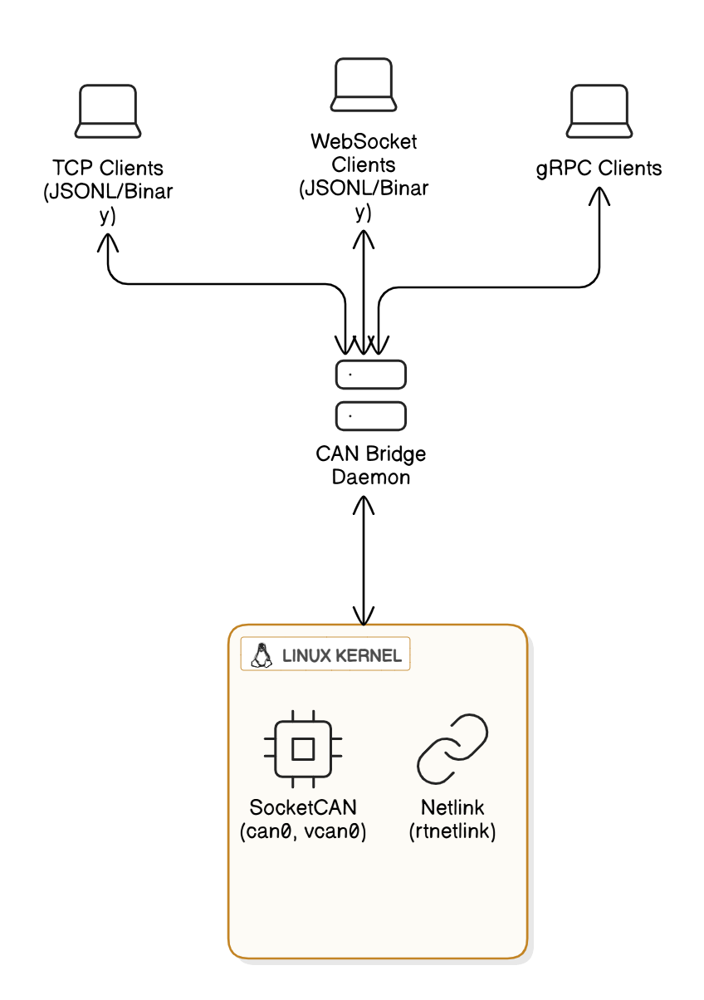{ width=50% }

The daemon sits between **clients** (tools, UI apps, scripts) and **SocketCAN**, allowing local or remote access to CAN interfaces through standardized transports.

---

### 3.2 External interfaces and actors

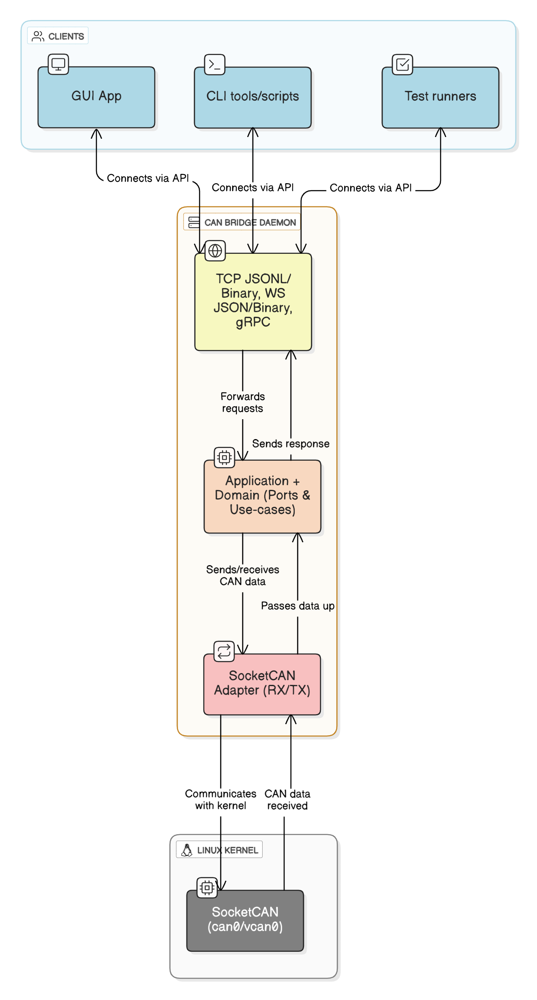{ width=80% }

The CAN Bridge System enables clients to interact with CAN networks through a centralized daemon.

- Clients (GUI app, CLI tools, test runners) connect via various transport APIs (TCP, WebSocket, gRPC).
- The daemon's application core manages business logic and use-cases.
- A SocketCAN adapter handles CAN message transmission and reception.
- Communication with the CAN network occurs through the Linux kernel's SocketCAN interface.

---

### 3.3. Use Cases

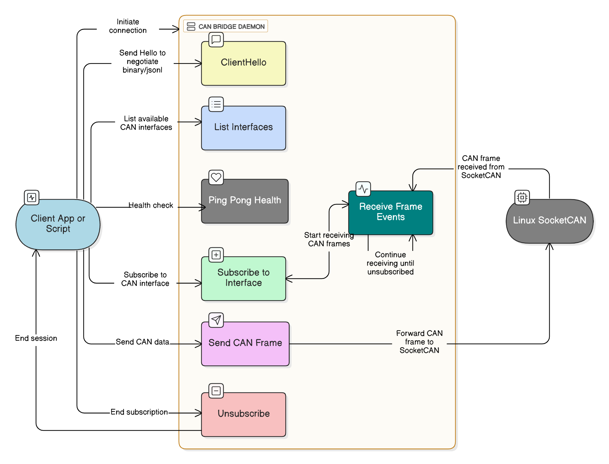{ width=90% }

The CAN Bridge Daemon facilitates communication between client applications and Linux SocketCAN interfaces.

- Clients initiate a connection and negotiate protocol (binary/JSONL).
- Available CAN interfaces can be listed and subscribed to for receiving frame events.
- Clients can send CAN frames, which are forwarded to SocketCAN.
- Health checks and unsubscribe actions are supported.
- Frame events are continuously received until the client unsubscribes.


### Connection lifecycle

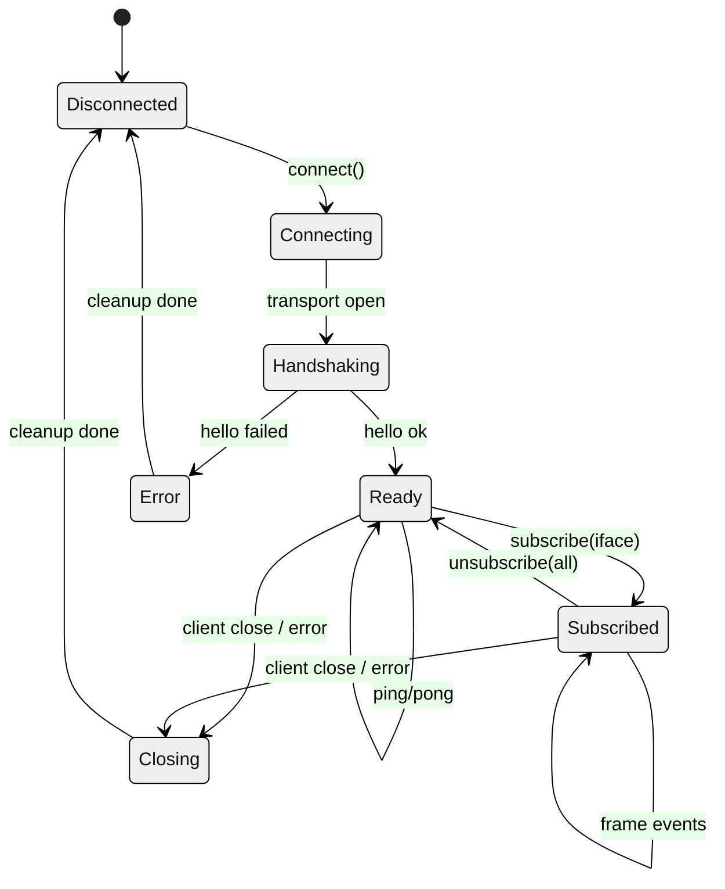
```mermaid
%%{init: {'theme': 'neutral', 'themeVariables': {
  'primaryColor': '#f2f2f2',
  'edgeLabelBackground':'#e6ffe6',
  'actorBorder':'#000000'
}}}%%
stateDiagram-v2
  [*] --> Disconnected
  Disconnected --> Connecting: connect()
  Connecting --> Handshaking: transport open
  Handshaking --> Ready: hello ok
  Handshaking --> Error: hello failed
  Ready --> Subscribed: subscribe(iface)
  Subscribed --> Ready: unsubscribe(all)
  Ready --> Ready: ping/pong
  Subscribed --> Subscribed: frame events
  Ready --> Closing: client close / error
  Subscribed --> Closing: client close / error
  Closing --> Disconnected: cleanup done
  Error --> Disconnected: cleanup done
```

### Application flow (Transport-agnostic)

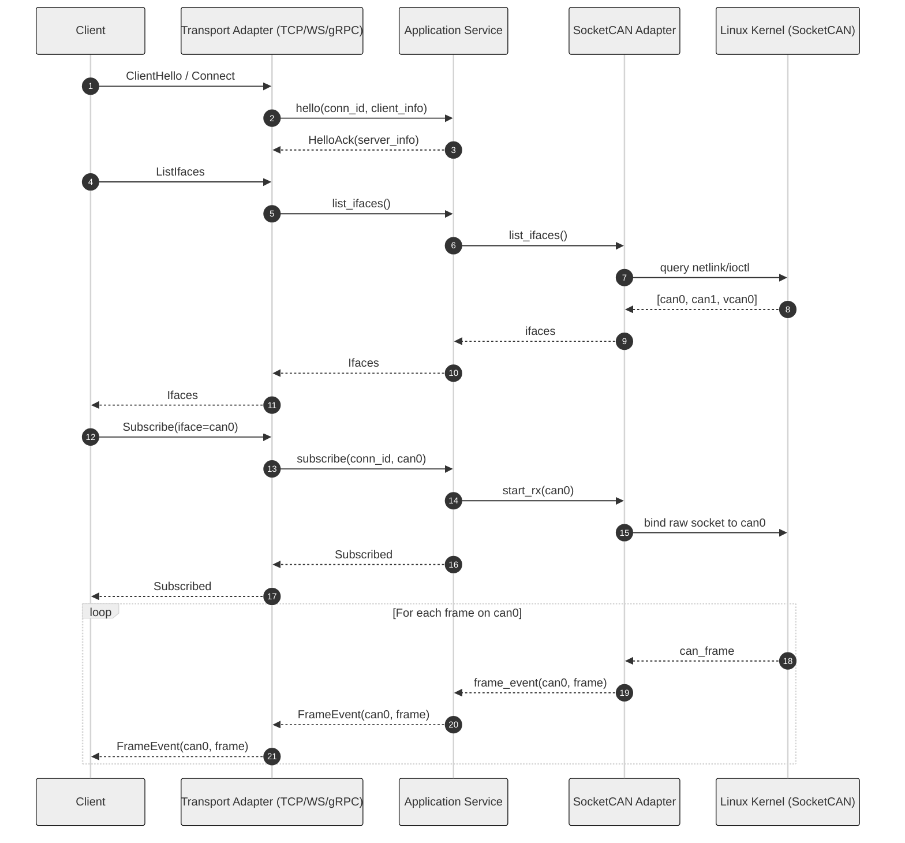
```mermaid
%%{init: {'theme': 'neutral', 'themeVariables': {
  'primaryColor': '#f2f2f2',
  'edgeLabelBackground':'#e6ffe6',
  'actorBorder':'#000000'
}}}%%
sequenceDiagram
  autonumber
  participant C as Client
  participant T as Transport Adapter (TCP/WS/gRPC)
  participant A as Application Service
  participant S as SocketCAN Adapter
  participant K as Linux Kernel (SocketCAN)

  C->>T: ClientHello / Connect
  T->>A: hello(conn_id, client_info)
  A-->>T: HelloAck(server_info)

  C->>T: ListIfaces
  T->>A: list_ifaces()
  A->>S: list_ifaces()
  S->>K: query netlink/ioctl
  K-->>S: [can0, can1, vcan0]
  S-->>A: ifaces
  A-->>T: Ifaces
  T-->>C: Ifaces

  C->>T: Subscribe(iface=can0)
  T->>A: subscribe(conn_id, can0)
  A->>S: start_rx(can0)
  S->>K: bind raw socket to can0
  A-->>T: Subscribed
  T-->>C: Subscribed

  loop For each frame on can0
    K-->>S: can_frame
    S-->>A: frame_event(can0, frame)
    A-->>T: FrameEvent(can0, frame)
    T-->>C: FrameEvent(can0, frame)
  end
```

## 4. Solution Strategy

### 4.1 Architectural Style

Daemon is treated as a **ports-and-adapters** system:

* **Domain** holds the CAN concepts (frame, interface name, subscription, etc.).
* **Application** defines the use-cases (list interfaces, subscribe/unsubscribe, send frame).
* **Inbound adapters** (TCP/WS/gRPC) translate protocol-specific messages into calls on **application inbound ports**.
* **Outbound adapters** (SocketCAN) implement **application outbound ports** to talk to the OS/kernel.
* Domain and application logic have **no dependency** on:

  * network transports
  * SocketCAN
  * async runtimes
* All external concerns are inverted behind ports.

The result: adding a new transport should not require touching the domain or reimplementing business logic.

---

### 4.2 Core Strategies

* **Event-driven architecture** using a broadcast bus
* **Per-connection state isolation**
* **Single writer per connection**
* **Socket reuse for TX**
* **Uniform semantics across transports**

---

### 4.3 Runtime strategy (high-level)

**Concurrency model (typical):**

* One task per client connection (TCP/WS) or per gRPC stream.
* A shared subscription manager in application/core:

  * tracks which connections are subscribed to which ifaces
  * ensures SocketCAN RX is opened once per iface and fan-out events
* SocketCAN RX loops feed `FrameEvent` into the app, which distributes to adapters.

This achieves:

* low duplication (one RX per iface)
* consistent filtering/backpressure
* simpler cleanup on disconnect

---

### 4.4 Error strategy (one error model, many renderings)

We use a single structured error concept in the core:

**Error fields (conceptual):**

* `code` (stable, machine-friendly)
* `message` (human-readable)
* `details` (optional structured data: iface, expected, got, etc.)
* `retryable` (bool)
* `source` (optional: “socketcan”, “transport”, “validation”)

**Adapter responsibility:** render errors into the native form:

* TCP/WS JSON: `{"type":"Error","code":"...","message":"...","details":{...}}`
* TCP/WS binary: `MsgType::Error` payload (structured)
* gRPC: map to `Status` codes + details (and/or an error message type)

This gives clients a predictable experience regardless of protocol.

---

## 5. Building Block View

This section answers: *what are the main building blocks, what does each do, and how do they interact?*

There are three typical levels: **Level 1 (system)** then **Level 2 (containers / subsystems inside the daemon)**, and then **Level 3 (key components)**.

### 5.1 Level 1 (Overall system whitebox)

At the highest level, the daemon is one executable that contains:

* **Inbound network adapters** (TCP/WS/gRPC servers)
* **Core application** (use-cases + ports)
* **Domain model** (CAN concepts)
* **Outbound infrastructure adapters** (SocketCAN, logging/metrics, config)

### Mermaid: Level 1 whitebox

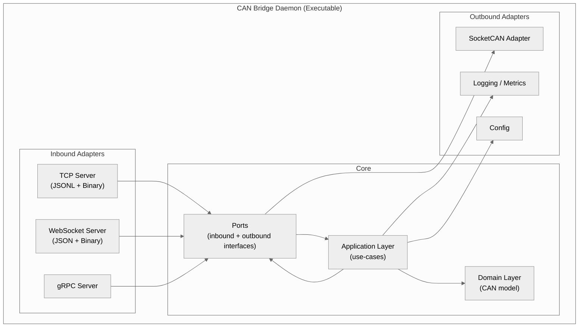
```mermaid
%%{init: {'theme': 'neutral', 'themeVariables': {
  'primaryColor': '#f2f2f2',
  'edgeLabelBackground':'#e6ffe6',
  'actorBorder':'#000000'
}}}%%
flowchart TB
  subgraph System["CAN Bridge Daemon (Executable)"]
    subgraph Inbound["Inbound Adapters"]
      TCP["TCP Server\n(JSONL + Binary)"]
      WS["WebSocket Server\n(JSON + Binary)"]
      GRPC["gRPC Server"]
    end

    subgraph Core["Core"]
      App["Application Layer\n(use-cases)"]
      Dom["Domain Layer\n(CAN model)"]
      Ports["Ports\n(inbound + outbound interfaces)"]
    end

    subgraph Outbound["Outbound Adapters"]
      Sock["SocketCAN Adapter"]
      Obs["Logging / Metrics"]
      Cfg["Config"]
    end
  end

  TCP --> Ports
  WS --> Ports
  GRPC --> Ports

  Ports --> App
  App --> Dom
  App --> Ports

  Ports --> Sock
  App --> Obs
  App --> Cfg
```

**Responsibility summary (Level 1):**

* **Inbound adapters**: parse/encode wire messages, manage connections, call inbound ports.
* **Core**: enforce behavior and business rules.
* **Outbound adapters**: interact with the kernel (SocketCAN), environment, and observability.

---

### 5.2 Level 2 – Subsystems overview/Internal Structure

Level 2 describes: “which module owns what?”

1. **transport/** (inbound)

* `tcp_jsonl`: line-delimited JSON server
* `tcp_binary`: binary framed server
* `ws_json`: websocket JSON server
* `ws_binary`: websocket binary server
* `grpc`: gRPC service impl (RPC + streaming)

2. **app/** (core application)

* use-cases (services)
* subscription manager (fan-out)
* connection/session registry
* validation, error mapping (core-level)

3. **domain/** (pure model)

* CAN frame structs (id, flags, dlc/len, data)
* interface identifiers
* shared enums: command/event types (transport-agnostic)
* domain errors (no IO)

4. **infra/** (outbound)

* `socketcan`: open/bind sockets, RX loop, TX send
* `observability`: logging, metrics hooks
* `config`: CLI/env/file, defaults


### 5.3 Building Block View — Level 3 (Key components)

Now we zoom into “high-leverage” components that matter for correctness and complexity. Major building blocks for this app are:

#### 5.3.1 BridgeService (Application Layer)

**Responsibilities**

* Central orchestration point
* Implements all use cases:

  * ping
  * list interfaces
  * subscribe
  * send frame
* Owns the frame broadcast channel
* Applies validation rules

**Explicit non-responsibilities**

* No JSON / protobuf parsing
* No socket IO
* No blocking operations

---

#### 5.3.2 Transport Adapters (TCP / WS / gRPC)

**Responsibilities**

* Connection lifecycle
* Protocol framing
* Parsing client requests
* Mapping protocol messages → service calls
* Serializing server responses
* Enforcing per-connection subscription filters

**Concurrency model**

* One task per connection
* One dedicated writer task per connection

---

#### 5.3.3 SocketCAN Adapter

**Responsibility**

* Enumerate interfaces (`can0`, `vcan0`, etc.)
* Open raw socket bound to iface
* RX loop emitting frames
* TX send frames

**Non-responsibility**

* No business rules (no subscription decisions)
* No client awareness

#### 5.3.4. SocketCAN RX Adapter

**Responsibilities**

* One RX loop per CAN interface
* Blocking reads isolated via `spawn_blocking`
* Convert kernel frames → `FrameEvent`
* Push events into the service bus

---

#### 5.3.5 SocketCAN TX Adapter

**Responsibilities**

* Validate CAN vs CAN-FD constraints
* Manage socket cache per interface
* Write frames to kernel
* Convert kernel errors to domain errors

---

#### 5.3.6 Transport: General Packet Flow/Session Handler

Each transport has a “session handler” per connection / stream.

**Responsibility**

* Read inbound messages from wire
* Decode → `CoreCommand`
* Call application inbound port
* Encode responses/events to wire
* Detect disconnects and invoke cleanup hook

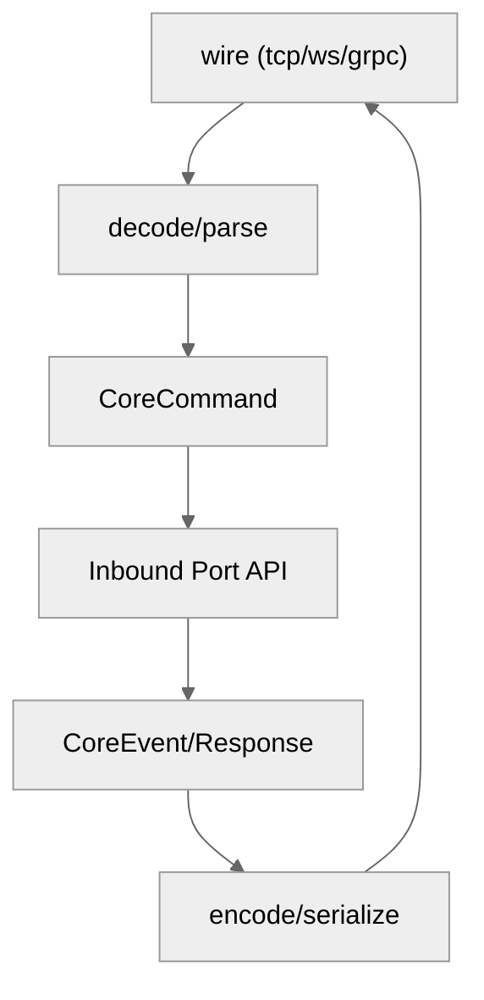
```mermaid
flowchart TB
%%{init: {'theme': 'neutral', 'themeVariables': {
  'primaryColor': '#f2f2f2',
  'edgeLabelBackground':'#e6ffe6',
  'actorBorder':'#000000'
}}}%%
  Wire["wire (tcp/ws/grpc)"] --> Decode["decode/parse"]
  Decode --> Cmd["CoreCommand"]
  Cmd --> App["Inbound Port API"]
  App --> Resp["CoreEvent/Response"]
  Resp --> Encode["encode/serialize"]
  Encode --> Wire
```

---

### 5.4 What goes where?

This is the checklist that prevents architecture drift.

#### Domain (`domain/`)

✅ Allowed:

* CAN types and validation helpers (pure)
* enums for core commands/events
* error types that don’t depend on IO
  🚫 Not allowed:
* JSON parsing, network code, tokio tasks
* SocketCAN syscalls

#### Application (`app/`)

✅ Allowed:

* Use-cases, orchestration, policies
* subscription tracking / fan-out rules
* mapping outbound adapter errors to core errors
* timeouts and retry/backoff policies (if needed)
  🚫 Not allowed:
* Binding sockets directly
* Writing websocket frames directly

#### Ports (`ports/`)

✅ Allowed:

* Traits/interfaces for inbound + outbound
* DTOs owned by core (transport-agnostic)
  🚫 Not allowed:
* Protocol-specific types (protobuf, websocket message types)

#### Transport adapters (`transport/`)

✅ Allowed:

* Wire parsing/serialization
* Connection lifecycle, per-conn tasks
* translating core errors to transport errors
  🚫 Not allowed:
* Subscription logic, per-iface fan-out policy
* Anything that touches SocketCAN directly

#### Infra adapters (`infra/`)

✅ Allowed:

* SocketCAN syscalls, netlink/ioctl
* Logging/metrics plumbing
* Config parsing
  🚫 Not allowed:
* Transport parsing logic
* Subscription semantics

---

## 6. Runtime View

This section documents the system behavior in concrete scenarios. Each scenario is written in a transport-agnostic way first (so the meaning is clear), then we note what differs for TCP JSONL / TCP Binary / WS / gRPC.

We’ll start with **Scenario 1: TCP JSONL** (because it’s easiest to reason about), and we’ll define the canonical sequence that all other transports must match.


### 6.1 Scenario 1 — TCP Connection Lifecycle

TCP JSONL: Connect → Hello → ListIfaces → Subscribe → Stream Frames → Unsubscribe → Disconnect

JSONL means:

* Each application message is a **single JSON object**
* Messages are delimited by **newline (`\n`)**
* Transport adapter must be robust to:

  * partial reads (a JSON object can arrive in chunks)
  * multiple messages in one read
  * trailing whitespace

**Adapter responsibility:** read-by-lines, parse JSON, map to core commands, serialize responses with `\n`

> **WS JSON**: message boundaries are WS frames (no JSONL newline needed).

#### 6.1.1 Narrative

A client opens a TCP connection to the daemon’s JSONL port. The daemon expects the client to identify itself (hello/handshake). Once the connection is “ready”, the client requests available CAN interfaces. The client then subscribes to one interface (e.g., `can0`) to receive `FrameEvent` messages. As frames arrive via SocketCAN, the daemon streams them to the client as JSON objects, one per line. The client may unsubscribe, then disconnect.

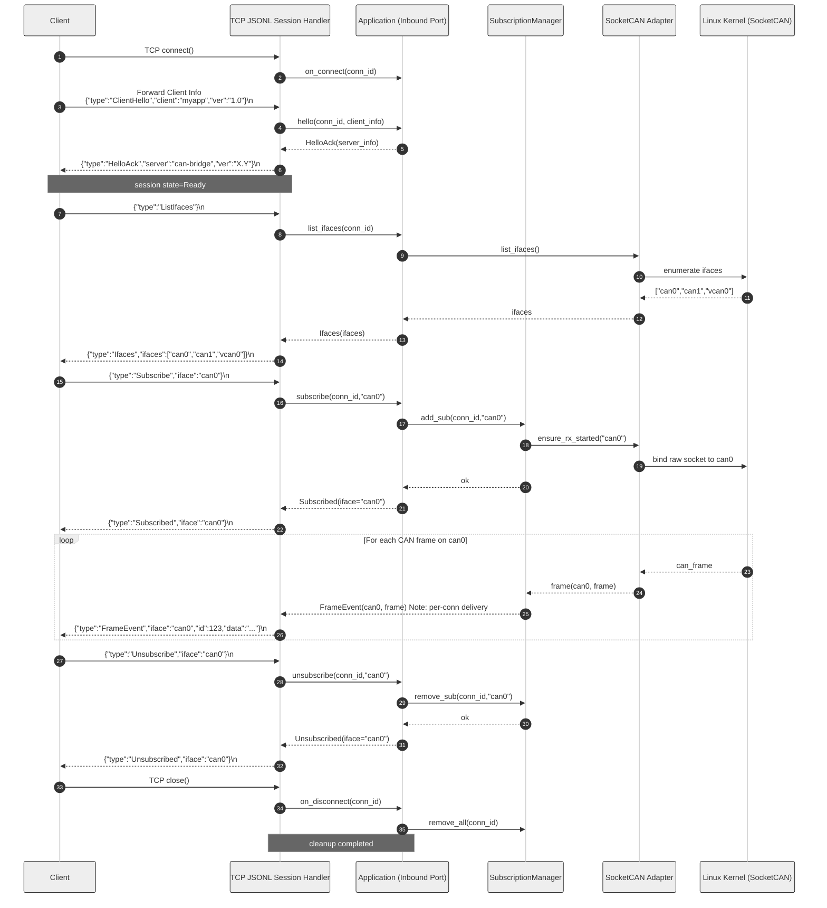
```mermaid
%%{init: {'theme': 'neutral', 'themeVariables': {
  'primaryColor': '#f2f2f2',
  'edgeLabelBackground':'#e6ffe6',
  'actorBorder':'#000000'
}}}%%
sequenceDiagram
  autonumber
  participant C as Client
  participant TJ as TCP JSONL Session Handler
  participant A as Application (Inbound Port)
  participant SM as SubscriptionManager
  participant SC as SocketCAN Adapter
  participant K as Linux Kernel (SocketCAN)

  C->>TJ: TCP connect()
  TJ->>A: on_connect(conn_id)

  C->>TJ: Forward Client Info <br/> {"type":"ClientHello","client":"myapp","ver":"1.0"}\n
  TJ->>A: hello(conn_id, client_info)
  A-->>TJ: HelloAck(server_info)
  TJ-->>C: {"type":"HelloAck","server":"can-bridge","ver":"X.Y"}\n
  Note over TJ,C: session state=Ready

  C->>TJ: {"type":"ListIfaces"}\n
  TJ->>A: list_ifaces(conn_id)
  A->>SC: list_ifaces()
  SC->>K: enumerate ifaces
  K-->>SC: ["can0","can1","vcan0"]
  SC-->>A: ifaces
  A-->>TJ: Ifaces(ifaces)
  TJ-->>C: {"type":"Ifaces","ifaces":["can0","can1","vcan0"]}\n

  C->>TJ: {"type":"Subscribe","iface":"can0"}\n
  TJ->>A: subscribe(conn_id,"can0")
  A->>SM: add_sub(conn_id,"can0")
  SM->>SC: ensure_rx_started("can0")
  SC->>K: bind raw socket to can0
  SM-->>A: ok
  A-->>TJ: Subscribed(iface="can0")
  TJ-->>C: {"type":"Subscribed","iface":"can0"}\n

  loop For each CAN frame on can0
    K-->>SC: can_frame
    SC-->>SM: frame(can0, frame)
    SM-->>TJ: FrameEvent(can0, frame)  Note: per-conn delivery
    TJ-->>C: {"type":"FrameEvent","iface":"can0","id":123,"data":"..."}\n
  end

  C->>TJ: {"type":"Unsubscribe","iface":"can0"}\n
  TJ->>A: unsubscribe(conn_id,"can0")
  A->>SM: remove_sub(conn_id,"can0")
  SM-->>A: ok
  A-->>TJ: Unsubscribed(iface="can0")
  TJ-->>C: {"type":"Unsubscribed","iface":"can0"}\n

  C->>TJ: TCP close()
  TJ->>A: on_disconnect(conn_id)
  A->>SM: remove_all(conn_id)
  Note over TJ,A: cleanup completed
```

#### 6.1.2 Scenario 2 — TCP JSONL: SendFrame → SendAck (TX path)

A connected client sends a CAN frame onto an interface. The daemon validates input, sends it to SocketCAN, and replies with an acknowledgment. If validation fails, it returns `Error`.

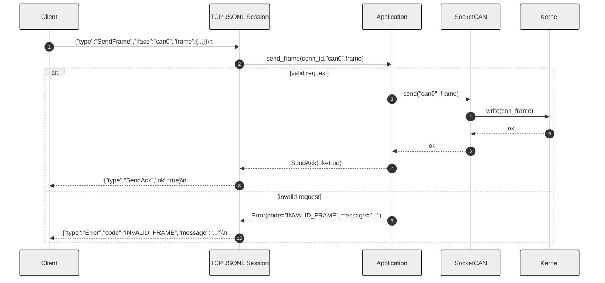
```mermaid
%%{init: {'theme': 'neutral', 'themeVariables': {
  'primaryColor': '#f2f2f2',
  'edgeLabelBackground':'#e6ffe6',
  'actorBorder':'#000000'
}}}%%
sequenceDiagram
  autonumber
  participant C as Client
  participant TJ as TCP JSONL Session
  participant A as Application
  participant SC as SocketCAN
  participant K as Kernel

  C->>TJ: {"type":"SendFrame","iface":"can0","frame":{...}}\n
  TJ->>A: send_frame(conn_id,"can0",frame)

  alt valid request
    A->>SC: send("can0", frame)
    SC->>K: write(can_frame)
    K-->>SC: ok
    SC-->>A: ok
    A-->>TJ: SendAck(ok=true)
    TJ-->>C: {"type":"SendAck","ok":true}\n
  else invalid request
    A-->>TJ: Error(code="INVALID_FRAME",message="...")
    TJ-->>C: {"type":"Error","code":"INVALID_FRAME","message":"..."}\n
  end
```

---

#### 6.1.3 Scenario 3 — TCP Binary

Framing + Hello + ListIfaces + Subscribe + FrameEvent + Errors

This scenario documents the **binary-framed TCP** protocol runtime behavior. The goal is that anyone can implement a client and write correct roundtrip tests.

I’ll describe it in three layers:

1. **Wire framing contract** (what bytes look like)
2. **Runtime sequence** (hello/list/subscribe/stream)
3. **Decoder state machine** (how to parse safely, how errors behave)


##### 6.1.3.1 Wire framing contract (binary)

###### Frame structure (conceptual)

Every binary message is:

* `MAGIC` (4 bytes)
* `HEADER` (fixed length, e.g., 12 bytes total header in your earlier snippet context)
* `PAYLOAD` (length indicated in header)

Standard values as per our header:

* `MAGIC = b"CBD1"`
* `HEADER_LEN = 12`

A typical header layout (example) is:

| Field         | Size | Type      | Meaning                       |
| ------------- | ---: | --------- | ----------------------------- |
| magic         |    4 | bytes     | Constant `CBD1`               |
| msg_type      |    2 | u16 LE/BE | identifies message type       |
| flags/version |    2 | u16       | optional, reserved for future |
| payload_len   |    4 | u32       | payload length in bytes       |

> In future, header can differ, but the *behavior* below stays the same: magic → type → length → payload.

###### Binary invariants (must always hold)

* **Magic must match** exactly.
* `payload_len` must be within sane bounds (e.g., max message size).
* Decoder must handle:

  * partial reads
  * coalesced frames (multiple messages in one read)
  * garbage bytes / desync (especially after client bugs)

##### 6.1.3.2 Runtime sequence — TCP Binary (canonical)

Client opens TCP connection to the binary port. Client sends a **ClientHello** (binary message). Server replies with **HelloAck**. From there, client can request **Ifaces**, **Subscribe**, and receive **FrameEvent** messages. For TX, client sends **SendFrame** and receives **SendAck**. Any validation or parsing error yields **Error**.

```mermaid
%%{init: {'theme': 'neutral', 'themeVariables': {
  'primaryColor': '#f2f2f2',
  'edgeLabelBackground':'#e6ffe6',
  'actorBorder':'#000000'
sequenceDiagram
  autonumber
  participant C as Client
  participant TB as TCP Binary Session Handler
  participant D as Binary Decoder/Encoder
  participant A as Application
  participant SM as SubscriptionManager
  participant SC as SocketCAN
  participant K as Kernel

  C->>TB: TCP connect()

  C->>TB: [MAGIC|HDR|payload] ClientHello
  TB->>D: feed(bytes)
  D-->>TB: Decoded(ClientHello)
  TB->>A: hello(conn_id, client_info)
  A-->>TB: HelloAck(server_info)
  TB->>D: encode(HelloAck)
  D-->>TB: [MAGIC|HDR|payload]
  TB-->>C: HelloAck frame
  Note over TB: state=Ready

  C->>TB: [MAGIC|HDR|payload] ListIfaces
  TB->>D: decode
  D-->>TB: ListIfaces
  TB->>A: list_ifaces(conn_id)
  A->>SC: list_ifaces()
  SC->>K: enumerate
  K-->>SC: ["can0","can1"]
  SC-->>A: ifaces
  A-->>TB: Ifaces
  TB-->>C: [MAGIC|HDR|payload] Ifaces

  C->>TB: [MAGIC|HDR|payload] Subscribe(can0)
  TB->>A: subscribe(conn_id,"can0")
  A->>SM: add_sub(conn_id,can0)
  SM->>SC: ensure_rx_started(can0)
  SC->>K: bind raw socket
  A-->>TB: Subscribed(can0)
  TB-->>C: [MAGIC|HDR|payload] Subscribed

  loop for each CAN frame
    K-->>SC: can_frame
    SC-->>SM: frame(can0,frame)
    SM-->>TB: FrameEvent(can0,frame)  Note: delivered to subscribed conns
    TB-->>C: [MAGIC|HDR|payload] FrameEvent
  end
```

---

##### 6.1.3.3 Error behavior (binary)

Binary protocol must clearly define what happens when something is wrong.

###### Case A: malformed magic / decoder desync

* If the first 4 bytes are not `CBD1`, the decoder enters a **resync scan** mode:

  * scan forward until a `CBD1` occurs
  * then attempt header+payload parse again
* If resync fails beyond some threshold, server should close connection (anti-DoS).

###### Case B: payload length too large

* If `payload_len > MAX_FRAME`, server:

  * sends `Error(code="FRAME_TOO_LARGE")` **if possible**
  * then closes connection (recommended)

###### Case C: unknown message type

* Reply with `Error(code="UNKNOWN_MSG_TYPE")` and keep connection open (usually safe).

###### Case D: valid frame but invalid semantics

Example: `Subscribe(iface="doesnotexist")`

* Reply with `Error(code="NO_SUCH_IFACE")` (connection stays open)

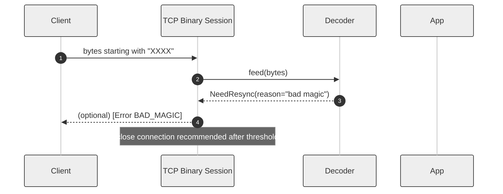
```mermaid
%%{init: {'theme': 'neutral', 'themeVariables': {
  'primaryColor': '#f2f2f2',
  'edgeLabelBackground':'#e6ffe6',
  'actorBorder':'#000000'
}}}%%
sequenceDiagram
  autonumber
  participant C as Client
  participant TB as TCP Binary Session
  participant D as Decoder
  participant A as App

  C->>TB: bytes starting with "XXXX"
  TB->>D: feed(bytes)
  D-->>TB: NeedResync(reason="bad magic")

  TB-->>C: (optional) [Error BAD_MAGIC]
  Note over TB: close connection recommended after threshold
```

---

##### 6.1.3.4 Binary decoder state machine 

This is the precise mental model for a correct implementation.

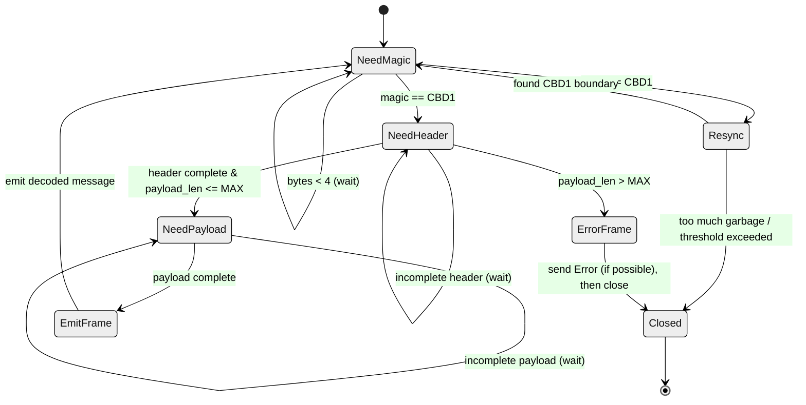
```mermaid
%%{init: {'theme': 'neutral', 'themeVariables': {
  'primaryColor': '#f2f2f2',
  'edgeLabelBackground':'#e6ffe6',
  'actorBorder':'#000000'
}}}%%
stateDiagram-v2
  [*] --> NeedMagic

  NeedMagic --> NeedHeader: magic == CBD1
  NeedMagic --> NeedMagic: bytes < 4 (wait)
  NeedMagic --> Resync: magic != CBD1

  Resync --> NeedMagic: found CBD1 boundary
  Resync --> Closed: too much garbage / threshold exceeded

  NeedHeader --> NeedPayload: header complete & payload_len <= MAX
  NeedHeader --> NeedHeader: incomplete header (wait)
  NeedHeader --> ErrorFrame: payload_len > MAX

  NeedPayload --> EmitFrame: payload complete
  NeedPayload --> NeedPayload: incomplete payload (wait)

  EmitFrame --> NeedMagic: emit decoded message

  ErrorFrame --> Closed: send Error (if possible), then close
  Closed --> [*]
```

---

##### 6.1.3.5 Binary encoder contract

Encoder must:

* produce the exact header layout consistently (endianness!)
* set `payload_len` correctly
* ensure `msg_type` matches the payload schema
* avoid partial writes issues:

  * either `write_all()` or a buffered writer that flushes entire frames

---

##### 6.1.3.6 Transport-specific note: TCP Binary vs WS Binary

Even if both are “binary”, their outer boundaries differ:

* **TCP Binary**: boundaries are inferred only by `MAGIC + header + payload_len`.
* **WS Binary**: each WS frame already has a boundary, but you may still keep the same inner framing for consistency.

### 6.2 WebSocket JSON + WebSocket Binary

WebSocket transports have the same **application semantics** as TCP, but different **message boundary** and **connection lifecycle** characteristics.

We’ll document both variants:

* **WS JSON**: each WS text message is one JSON object.
* **WS Binary**: each WS binary message carries either:

  * **Option A (recommended):** the same `CBD1` binary framing as TCP Binary (portable, consistent)
  * **Option B:** use WS message boundary as the frame boundary (simpler, but different from TCP)

Even if both are documented, mark A as the consistency-first approach.

---

#### 6.2.1 WS JSON — Connect → Hello → Subscribe → Stream

Client opens a WS connection to `/ws/json` (or your configured path). Server accepts. Client sends a JSON `ClientHello` as the first message. After `HelloAck`, the session is Ready. Client can then list interfaces, subscribe, send frames, and receive `FrameEvent` as WS text messages.

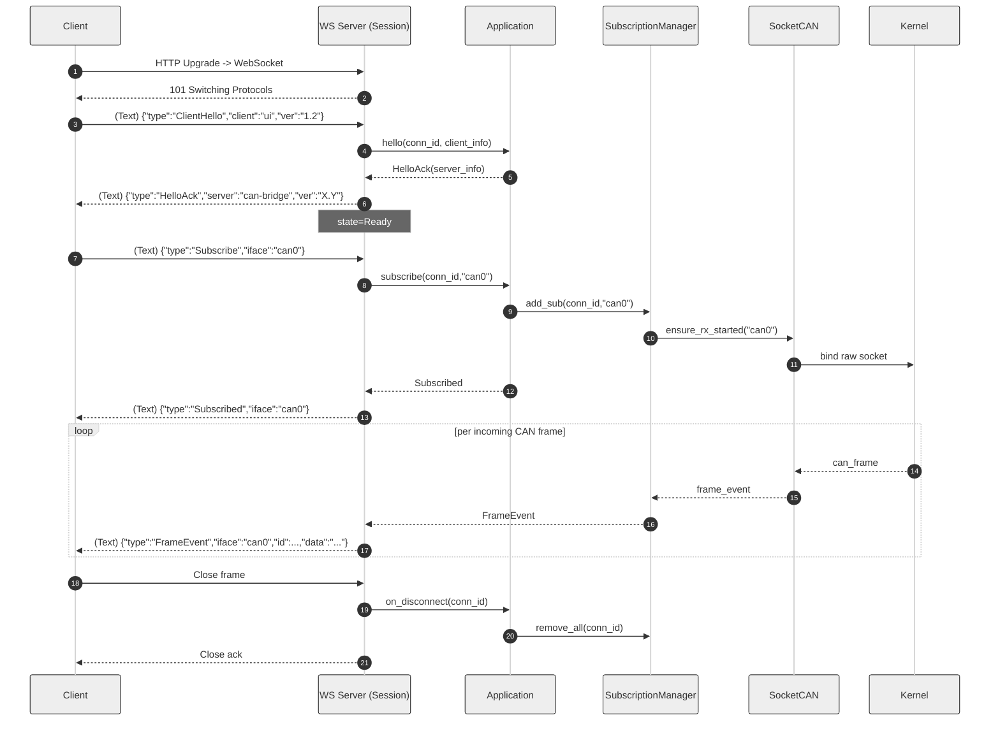
```mermaid
%%{init: {'theme': 'neutral', 'themeVariables': {
  'primaryColor': '#f2f2f2',
  'edgeLabelBackground':'#e6ffe6',
  'actorBorder':'#000000'
}}}%%
sequenceDiagram
  autonumber
  participant C as Client
  participant WS as WS Server (Session)
  participant A as Application
  participant SM as SubscriptionManager
  participant SC as SocketCAN
  participant K as Kernel

  C->>WS: HTTP Upgrade -> WebSocket
  WS-->>C: 101 Switching Protocols

  C->>WS: (Text) {"type":"ClientHello","client":"ui","ver":"1.2"}
  WS->>A: hello(conn_id, client_info)
  A-->>WS: HelloAck(server_info)
  WS-->>C: (Text) {"type":"HelloAck","server":"can-bridge","ver":"X.Y"}
  Note over WS: state=Ready

  C->>WS: (Text) {"type":"Subscribe","iface":"can0"}
  WS->>A: subscribe(conn_id,"can0")
  A->>SM: add_sub(conn_id,"can0")
  SM->>SC: ensure_rx_started("can0")
  SC->>K: bind raw socket
  A-->>WS: Subscribed
  WS-->>C: (Text) {"type":"Subscribed","iface":"can0"}

  loop per incoming CAN frame
    K-->>SC: can_frame
    SC-->>SM: frame_event
    SM-->>WS: FrameEvent
    WS-->>C: (Text) {"type":"FrameEvent","iface":"can0","id":...,"data":"..."}
  end

  C->>WS: Close frame
  WS->>A: on_disconnect(conn_id)
  A->>SM: remove_all(conn_id)
  WS-->>C: Close ack
```

##### Notes specific to WS JSON

* No JSONL `\n` delimiter is needed.
* The WS server must defend against:

  * clients sending binary frames on the JSON endpoint (either reject or treat as protocol error)
  * message size limits

---

##### 6.2.2 WS Binary — framing options and recommendation

###### Option A (recommended): Inner `CBD1` framing inside WS binary messages

**Why**

* A single binary decoder/encoder can be shared for both TCP and WS.
* Roundtrip tests can reuse the same vectors.
* Clients can implement one binary protocol and run it over TCP *or* WS.

**Contract**

* Each WS binary message may contain **one or more** `CBD1` frames (batching allowed).
* Or it may contain exactly one frame (simpler) — but allow “multiple” for robustness.

###### Sequence diagram — WS Binary (Option A)

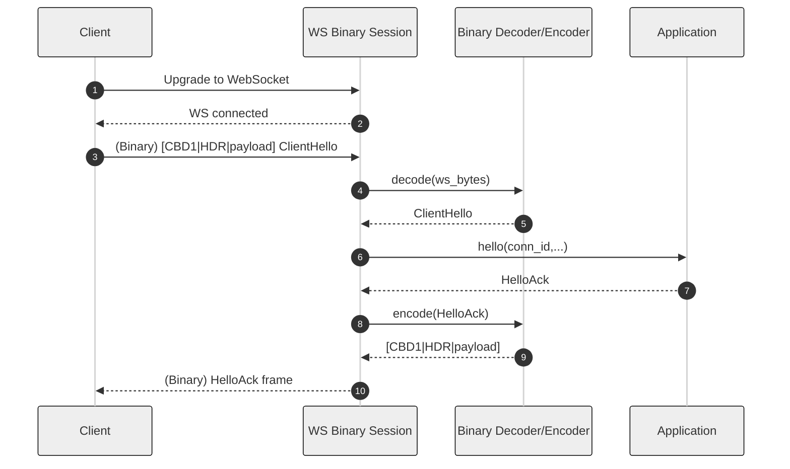
```mermaid
%%{init: {'theme': 'neutral', 'themeVariables': {
  'primaryColor': '#f2f2f2',
  'edgeLabelBackground':'#e6ffe6',
  'actorBorder':'#000000'
}}}%%
sequenceDiagram
  autonumber
  participant C as Client
  participant WB as WS Binary Session
  participant D as Binary Decoder/Encoder
  participant A as Application

  C->>WB: Upgrade to WebSocket
  WB-->>C: WS connected

  C->>WB: (Binary) [CBD1|HDR|payload] ClientHello
  WB->>D: decode(ws_bytes)
  D-->>WB: ClientHello
  WB->>A: hello(conn_id,...)
  A-->>WB: HelloAck
  WB->>D: encode(HelloAck)
  D-->>WB: [CBD1|HDR|payload]
  WB-->>C: (Binary) HelloAck frame
```

###### Option B: WS message boundary is the frame (no inner magic/header)

**Why**

* Implementation simplicity: 1 WS message = 1 command/event.
* No resync scanning.

**Trade-off**

* Binary protocol becomes “WS-specific”.
* Can’t reuse the exact same framing as TCP Binary.

If we do this, we must define:

* a WS-binary payload schema (e.g., protobuf, bincode, or custom fixed layout)
* a versioning strategy and max size limits

---

##### 6.2.3 WS close + error semantics

WebSocket adds a “close code” mechanism. We recommend:

* **Normal client close** → close code `1000`
* **Protocol error** (invalid JSON / invalid binary framing) → `1002` (protocol error)
* **Message too big** → `1009`
* **Internal error** → `1011`

**Important rule:** even if you send an app-level `Error` message, you may still close the WS if the client violated the protocol.

###### State diagram — WS connection lifecycle

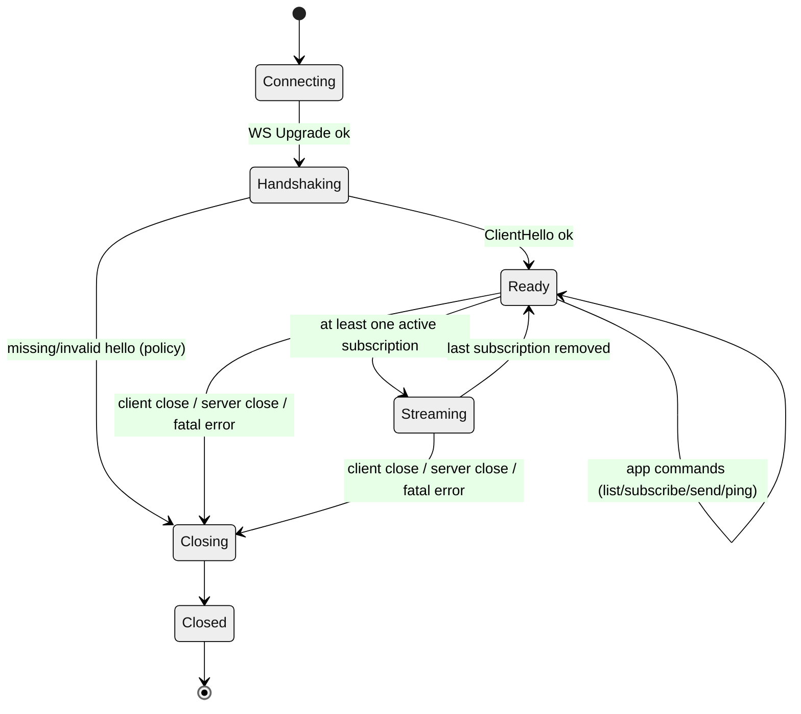
```mermaid
%%{init: {'theme': 'neutral', 'themeVariables': {
  'primaryColor': '#f2f2f2',
  'edgeLabelBackground':'#e6ffe6',
  'actorBorder':'#000000'
}}}%%
stateDiagram-v2
  [*] --> Connecting
  Connecting --> Handshaking: WS Upgrade ok
  Handshaking --> Ready: ClientHello ok
  Handshaking --> Closing: missing/invalid hello (policy)
  Ready --> Ready: app commands (list/subscribe/send/ping)
  Ready --> Streaming: at least one active subscription
  Streaming --> Ready: last subscription removed
  Ready --> Closing: client close / server close / fatal error
  Streaming --> Closing: client close / server close / fatal error
  Closing --> Closed
  Closed --> [*]
```

---

##### 6.2.4 WS Ping/Pong: WS layer vs app layer

You may have **two kinds of health**:

1. **WebSocket ping/pong frames** (low-level liveness)
2. **Application Ping/Pong message** (measures app latency end-to-end)

Recommendation:

* Use WS ping/pong internally for keepalive (especially through proxies).
* Keep app-level Ping/Pong as part of the protocol for consistent behavior across TCP, WS, and gRPC.

---

##### 6.2.5 Example message shapes (WS JSON)

Examples (one per WS text message):

```json
{"type":"ClientHello","client":"ui","ver":"1.2","features":["json"]}
{"type":"HelloAck","server":"can-bridge","ver":"0.9.0"}
{"type":"Subscribe","iface":"can0"}
{"type":"FrameEvent","iface":"can0","ts":1730000000,"id":291,"ext":true,"data":"11223344"}
{"type":"Error","code":"NO_SUCH_IFACE","message":"iface can9 not found","details":{"iface":"can9"}}
```

(Schemas are formalized  in Section 8 + an appendix, but these are good mental anchors.)

---

### 6.3 GRPC runtime view (Unary + Streaming, Cancellation, Backpressure)

gRPC is structurally different from TCP/WS because:

* request/response is explicit (unary RPC)
* streaming is built-in (server streaming or bidirectional streaming)
* cancellation is standardized (client cancels → server gets a signal)

Here, we’ll document a **recommended** service shape that mirrors your existing semantics cleanly, and then show the runtime sequences.

---

#### 6.3.1 Recommended gRPC service design

We can model this in two common ways:

##### Option A (recommended): “Session” with bidirectional stream for commands + events

This mirrors TCP/WS best: one long-lived channel per client.

* Client sends: `ClientHello`, `Subscribe`, `SendFrame`, etc.
* Server sends: `HelloAck`, `Ifaces`, `FrameEvent`, `Error`, etc.

**Benefits**

* Exactly matches the message model used by TCP/WS.
* One stream for everything; simplest for “live UI client” behavior.

**Trade-offs**

* Slightly more work than pure unary methods.
* Requires careful per-connection state management (but we already do that).

##### Option B: Unary RPCs + server-streaming “Subscribe”

Example:

* `Hello`, `ListIfaces`, `SendFrame` are unary
* `Subscribe(iface)` returns stream of `FrameEvent`

**Benefits**

* Feels more “gRPC-native”
* Very clear separation of operations

**Trade-offs**

* Multi-subscribe is harder: multiple streams per client
* Connection state (hello/auth) must be repeated or metadata-based

Because our daemon already has a “session mindset” (conn_id, subscribe/unsubscribe, stream events), **Option A** tends to be the best fit.

---

#### 6.3.2 Runtime — gRPC Option A (bi-di stream)

**Conceptual RPC:**

`rpc Connect(stream ClientMsg) returns (stream ServerMsg);`

Where:

* `ClientMsg` contains oneof: `ClientHello`, `Ping`, `ListIfaces`, `Subscribe`, `Unsubscribe`, `SendFrame`
* `ServerMsg` contains oneof: `HelloAck`, `Pong`, `Ifaces`, `Subscribed`, `Unsubscribed`, `SendAck`, `FrameEvent`, `Error`

##### gRPC bi-di session

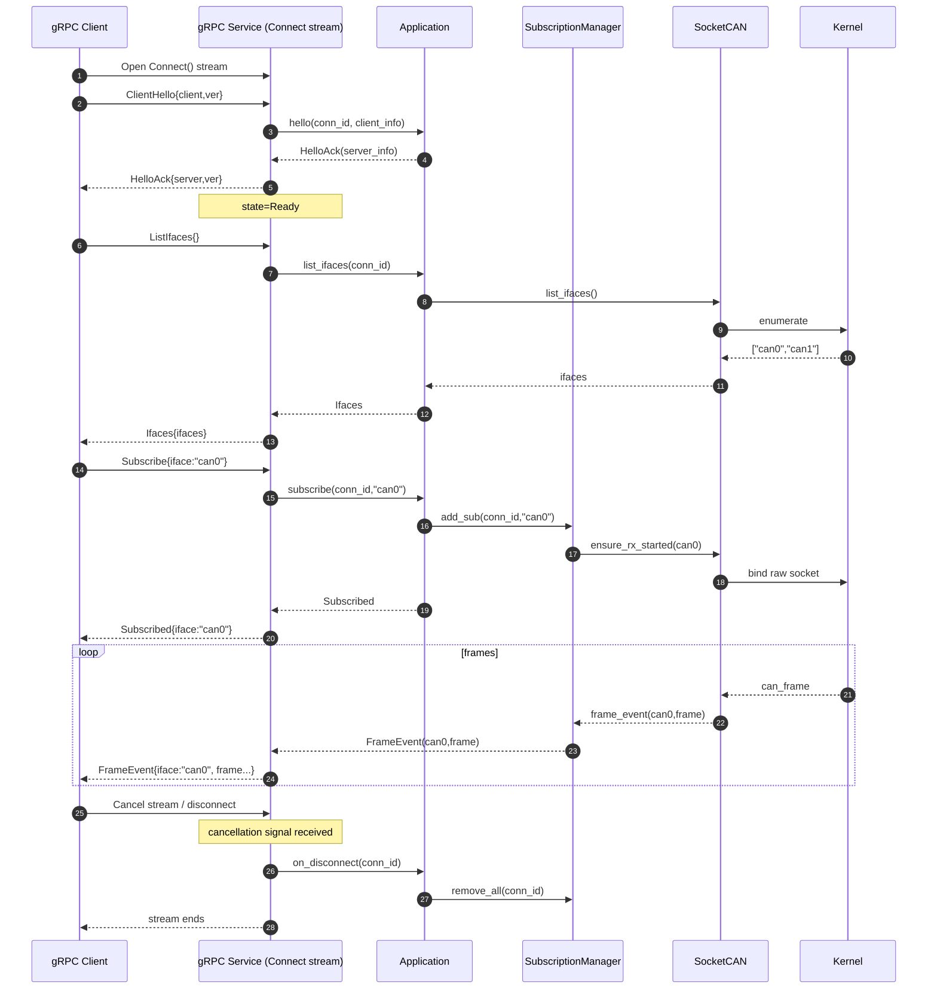
```mermaid
sequenceDiagram
  autonumber
  participant C as gRPC Client
  participant G as gRPC Service (Connect stream)
  participant A as Application
  participant SM as SubscriptionManager
  participant SC as SocketCAN
  participant K as Kernel

  C->>G: Open Connect() stream

  C->>G: ClientHello{client,ver}
  G->>A: hello(conn_id, client_info)
  A-->>G: HelloAck(server_info)
  G-->>C: HelloAck{server,ver}
  Note over G: state=Ready

  C->>G: ListIfaces{}
  G->>A: list_ifaces(conn_id)
  A->>SC: list_ifaces()
  SC->>K: enumerate
  K-->>SC: ["can0","can1"]
  SC-->>A: ifaces
  A-->>G: Ifaces
  G-->>C: Ifaces{ifaces}

  C->>G: Subscribe{iface:"can0"}
  G->>A: subscribe(conn_id,"can0")
  A->>SM: add_sub(conn_id,"can0")
  SM->>SC: ensure_rx_started(can0)
  SC->>K: bind raw socket
  A-->>G: Subscribed
  G-->>C: Subscribed{iface:"can0"}

  loop frames
    K-->>SC: can_frame
    SC-->>SM: frame_event(can0,frame)
    SM-->>G: FrameEvent(can0,frame)
    G-->>C: FrameEvent{iface:"can0", frame...}
  end

  C->>G: Cancel stream / disconnect
  Note over G: cancellation signal received
  G->>A: on_disconnect(conn_id)
  A->>SM: remove_all(conn_id)
  G-->>C: stream ends
```

---

#### 6.3.3 Cancellation and cleanup (gRPC specific)

##### Rules

* When the client cancels the stream (or loses network), the server must treat it like a disconnect:

  * remove subscriptions for that conn
  * release per-conn resources (queues, counters)
* If the server terminates the stream due to protocol error, it should:

  * send an `Error` message if possible
  * then end stream with appropriate gRPC status (e.g., `INVALID_ARGUMENT`)

##### gRPC stream lifecycle

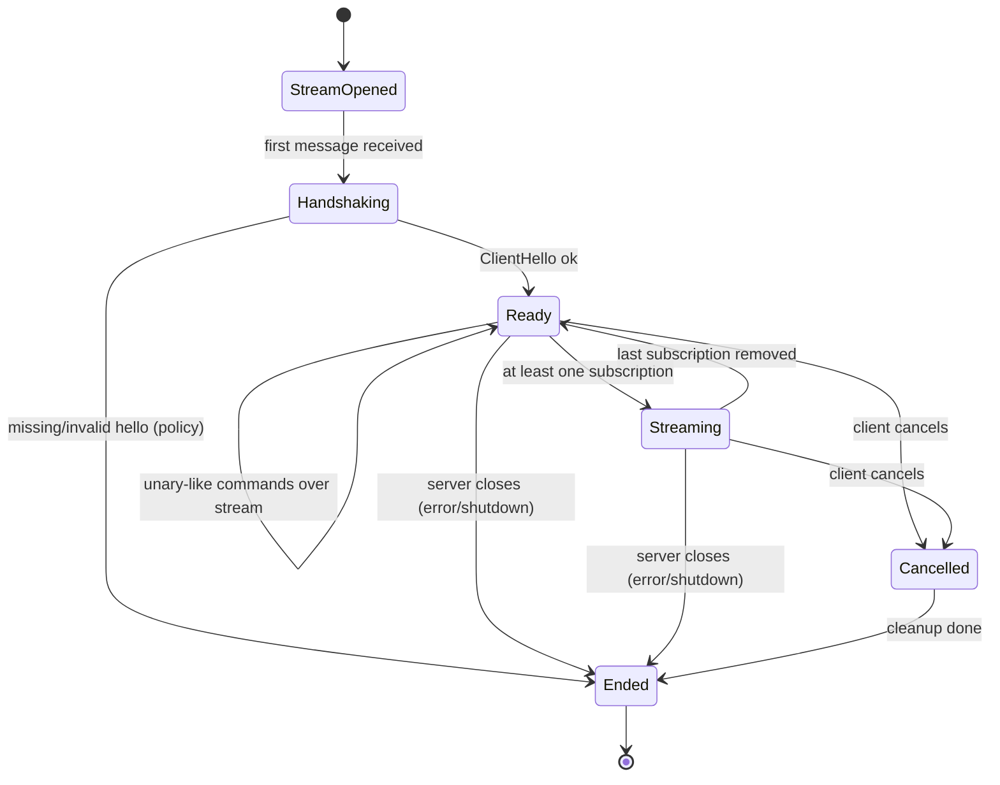
```mermaid
stateDiagram-v2
  [*] --> StreamOpened
  StreamOpened --> Handshaking: first message received
  Handshaking --> Ready: ClientHello ok
  Handshaking --> Ended: missing/invalid hello (policy)

  Ready --> Ready: unary-like commands over stream
  Ready --> Streaming: at least one subscription
  Streaming --> Ready: last subscription removed

  Ready --> Cancelled: client cancels
  Streaming --> Cancelled: client cancels

  Ready --> Ended: server closes (error/shutdown)
  Streaming --> Ended: server closes (error/shutdown)

  Cancelled --> Ended: cleanup done
  Ended --> [*]
```

---

#### 6.3.4 Backpressure strategy (gRPC view)

Streaming introduces the question: *what if frames come faster than the client can read?*

We’ll standardize this later in Section 8, but runtime-wise:

* **SubscriptionManager → Transport Adapter** should use a bounded queue per connection.
* When queue is full, choose a policy:

  1. **Drop oldest FrameEvent** (keep latest)
  2. **Drop newest** (keep backlog)
  3. **Disconnect slow consumer** (strict)

For gRPC, “slow consumer” is common; gRPC write calls will eventually apply backpressure.

##### Backpressure (high-level)

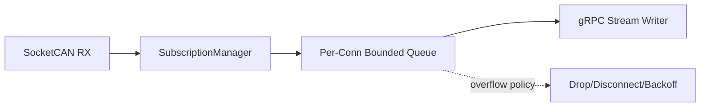
```mermaid
flowchart LR
  RX[SocketCAN RX] --> SM[SubscriptionManager]
  SM --> Q[Per-Conn Bounded Queue]
  Q --> G[gRPC Stream Writer]

  Q -. overflow policy .-> Drop[Drop/Disconnect/Backoff]
```

---

#### 6.3.5 Mapping errors to gRPC statuses

We want consistent error semantics across protocols, but gRPC requires a status code.

Recommended mapping (example):

| Core error code                  | gRPC status         | Notes                |
| -------------------------------- | ------------------- | -------------------- |
| INVALID_ARGUMENT / INVALID_FRAME | INVALID_ARGUMENT    | client sent bad data |
| NO_SUCH_IFACE                    | NOT_FOUND           | iface unknown        |
| NOT_SUBSCRIBED                   | FAILED_PRECONDITION | state mismatch       |
| INTERNAL / SOCKETCAN_FAIL        | INTERNAL            | server-side          |
| UNAUTHENTICATED                  | UNAUTHENTICATED     | if/when auth exists  |
| PERMISSION_DENIED                | PERMISSION_DENIED   | if/when ACL exists   |

Even if you set a gRPC status, it’s still useful to also send a structured `Error` message on the stream *before* terminating (when possible).

---

## 7. Deployment View

This section explains **where** the daemon runs, what it depends on at runtime, how clients reach it, and how it fits into typical environments (developer laptop, test rig, embedded Linux box, CI).

### 7.1 Deployment environments (typical)

#### Environment A — Developer machine (local)

* Daemon runs on a Linux machine with SocketCAN enabled.
* Interfaces may be real (`can0`) or virtual (`vcan0`).
* Clients can be local processes (UI, scripts) connecting to `127.0.0.1`.

#### Environment B — Remote CAN gateway (network)

* Daemon runs on a Linux gateway connected to a CAN bus.
* Remote clients connect over LAN/WAN via TCP/WS/gRPC.
* Firewall/TLS/auth become relevant.

#### Environment C — CI test environment

* Daemon runs in CI runner with `vcan` (or using `--no-vcan-setup` if externally provided).
* Automated tests validate:

  * protocol correctness (JSONL/binary)
  * reconnection/cleanup behavior
  * framing roundtrips

---

### 7.2 Deployment diagram (Mermaid)

This diagram shows the common “remote gateway” layout.

![[image/deployment_diagram.png]]

---

### 7.3 Processes and runtime dependencies

#### Required runtime dependencies

* Linux kernel with SocketCAN support (e.g., `can`, `can_raw`, `vcan` modules when used)
* Permission to open/bind CAN raw sockets:

  * either run as root
  * or grant capabilities (preferred): `CAP_NET_RAW`, `CAP_NET_ADMIN` (depending on iface mgmt needs)

#### Optional dependencies (recommended in real deployments)

* systemd for service management
* journald for logs
* firewall rules / reverse proxy for TLS
* monitoring agent (Prometheus scrape, etc.) if you expose metrics

---

### 7.4 Network endpoints (deployment contract)

You have multiple protocols. Deployment view should explicitly list them.

#### Example endpoint inventory (template)

| Protocol   | Purpose                | Bind/Port           | Notes               |
| ---------- | ---------------------- | ------------------- | ------------------- |
| TCP JSONL  | human-friendly text    | `0.0.0.0:PORT_A`    | line-delimited JSON |
| TCP Binary | low overhead           | `0.0.0.0:PORT_B`    | `CBD1` framing      |
| WS JSON    | browser-friendly       | `0.0.0.0:PORT_C/ws/jsonl` | text WS messages    |
| WS Binary  | low overhead WS        | `0.0.0.0:PORT_C/ws/binary` | binary WS messages  |
| gRPC       | structured RPC/streams | `0.0.0.0:PORT_D`    | ideally behind TLS  |

---

### 7.5 systemd deployment (recommended)

For stable operation on a gateway, run the daemon as a systemd service:

* restart on failure
* log to journald
* define explicit bind address + ports
* define capability bounding set (avoid full root)

#### Example systemd unit (template)

```ini
[Unit]
Description=CAN Bridge Daemon
After=network-online.target
Wants=network-online.target

[Service]
Type=simple
ExecStart=/usr/local/bin/can-bridge-daemon \
  --bind 0.0.0.0 \
  --tcp-port 29535 \
  --ws-port 29536 \
  --grpc-port 29537

Restart=always
RestartSec=1

# Security hardening (tune as needed)
NoNewPrivileges=true
PrivateTmp=true
ProtectSystem=strict
ProtectHome=true

# Capabilities (example — adjust for your needs)
AmbientCapabilities=CAP_NET_RAW CAP_NET_ADMIN
CapabilityBoundingSet=CAP_NET_RAW CAP_NET_ADMIN

[Install]
WantedBy=multi-user.target
```

(We’ll align flags with your actual CLI in Section 8 “Config”.)

---

### 7.6 Security posture in deployment view (baseline)

Even if auth is not implemented yet, it is better:

* Bind to `127.0.0.1` by default in dev mode (safer)
* For remote use:

  * use firewall allowlist
  * prefer TLS termination at a reverse proxy
  * consider network segmentation (CAN is sensitive)
* Log remote peer IP and connection ID for traceability

---

## 8. Cross-cutting Concepts

This section defines the “rules” that apply across the whole system: message model, error model, framing, backpressure, versioning, config, and observability. These are the things that keep TCP/WS/gRPC behaving the same.

We’ll start with the three most important concepts for our daemon:

1. **Canonical message model** (transport-agnostic)
2. **Error model** (stable codes + structured details)
3. **Backpressure policy** (what happens when clients are slow)

---

### 8.1 Canonical message model (transport-agnostic)

All transports (TCP JSONL, TCP Binary, WS JSON, WS Binary, gRPC) must represent the same set of commands/events.

#### Message families

##### Client → Daemon (commands)

* `ClientHello`
* `Ping`
* `ListIfaces`
* `Subscribe`
* `Unsubscribe`
* `SendFrame`

##### Daemon → Client (responses/events)

* `HelloAck`
* `Pong`
* `Ifaces`
* `Subscribed`
* `Unsubscribed`
* `SendAck`
* `FrameEvent`
* `Error`

##### Message envelope rule

Every transport must convey at least:

* the **message type**
* the **message payload**
* (optional) a correlation id (useful for async responses)

For JSON, the common envelope is:

* `"type": "<MessageType>"`

For binary, message type is `msg_type` in the header.

For gRPC, `oneof` is the equivalent of type.

---

### 8.2 Canonical data model: CAN frame

#### 8.2.1 Domain view

A CAN frame in the daemon’s domain should be representable without transport concerns:

* `iface`: interface name (`"can0"`)
* `id`: arbitration ID (11-bit or 29-bit)
* `extended`: bool (true = extended/29-bit)
* `rtr`: bool (remote transmission request) if you support it
* `fd`: bool (CAN FD) if supported
* `brs`: bool (bit rate switch) if supported
* `esi`: bool (error state indicator) if supported
* `dlc/len`: payload length (0–8 classic CAN, up to 64 for CAN FD)
* `data`: bytes payload
* `timestamp` (optional but useful for events)

---

### 8.3 Canonical error model

Clients should not have to guess what went wrong or treat each protocol differently.

#### Error object fields (conceptual)

* `code`: stable identifier (string)
* `message`: user-friendly summary
* `details`: optional structured object
* `retryable`: boolean
* `source`: `transport | validation | socketcan | internal`

#### Recommended core error codes (starter set)

| Code                   | Meaning                          | Typical action                   |
| ---------------------- | -------------------------------- | -------------------------------- |
| `INVALID_JSON`         | JSON parse failed                | client bug (fix request)         |
| `INVALID_BINARY_FRAME` | bad magic/header/len             | client bug; may close            |
| `UNKNOWN_MSG_TYPE`     | unknown message type             | client bug                       |
| `MISSING_HELLO`        | command before hello             | send hello first                 |
| `NO_SUCH_IFACE`        | iface not present                | choose valid iface               |
| `INVALID_FRAME`        | ID/len/flags invalid             | fix payload                      |
| `NOT_SUBSCRIBED`       | unsubscribe without subscription | treat as no-op or error (policy) |
| `SOCKETCAN_IO`         | kernel send/recv error           | retry or investigate             |
| `INTERNAL`             | unexpected server failure        | report bug                       |

#### Rendering per transport

* JSON: `{"type":"Error","code":"...","message":"...","details":{...}}`
* Binary: `MsgType::Error` with a structured payload (e.g., code + message + optional kv)
* gRPC: optionally send `Error` message on stream + map to gRPC `Status`

---

### 8.4 Backpressure and slow consumers

#### Problem

CAN traffic can be high-frequency. If the daemon blindly queues events per client, memory grows and latency explodes.

#### Design principle

**Bounded buffering per connection**, with an explicit overflow policy.

#### Recommended default policy (good for UIs)

* Maintain a bounded queue per connection, e.g. `N = 1000` events.
* On overflow:

  * **drop oldest** events (“keep latest”), and increment a drop counter.
* Periodically (or on threshold), notify client:

  * either via a lightweight `Error`/`Warning` event
  * or via connection stats (future feature)

This gives the best UX: UIs typically care about “what’s happening now” more than perfect history.

#### Alternative policy (strict reliability)

* On overflow, **disconnect** slow client with `Error(code="SLOW_CONSUMER")`.
* Used when correctness is more important than convenience.

#### Mermaid: backpressure mechanics

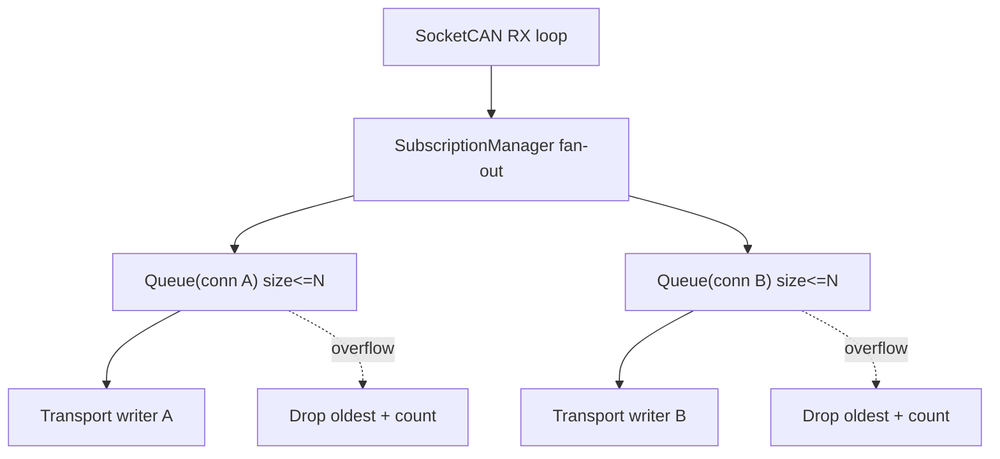
```mermaid
flowchart TB
  RX["SocketCAN RX loop"] --> SM["SubscriptionManager fan-out"]

  SM --> Q1["Queue(conn A) size<=N"]
  SM --> Q2["Queue(conn B) size<=N"]

  Q1 --> TA["Transport writer A"]
  Q2 --> TB["Transport writer B"]

  Q1 -. overflow .-> DropOldA["Drop oldest + count"]
  Q2 -. overflow .-> DropOldB["Drop oldest + count"]
```

---

### 8.5 Versioning and compatibility

#### Rule: protocol version handshake

On `ClientHello`, client declares:

* `client name`
* `client version`
* optionally `protocol version` and supported features

Server replies with `HelloAck`:

* server version
* protocol version selected
* feature flags

#### Compatibility promises (recommended)

* Additive changes to JSON (new optional fields) are backward compatible.
* Binary:

  * version field in header (or in hello) must allow evolution.
  * unknown fields must be ignorable if TLV/length-delimited encoding is used.
* gRPC:

  * protobuf supports backward compatibility if you follow best practices (no renumbering fields, etc.)

---

### 8.6 Timeouts and keepalive (cross-protocol)

Recommended behavior:

* if no message received for `T_idle` (configurable), server may send `Ping` or close.
* for WS, also use WS ping frames if behind proxies.
* for gRPC, set keepalive in server settings to detect dead clients.

We’ll define default values later in the “Quality Requirements” section.

---

### 8.7 Observability (logs + correlation)

* `tracing` spans per connection
* RX/TX events logged
* Lag detection logged

Minimum recommended log fields:

* `conn_id`
* `peer addr`
* `transport` (tcp_jsonl/tcp_bin/ws_json/ws_bin/grpc)
* `iface` (for subscribe/send)
* `msg_type` (for debug)
* `error_code` (when errors occur)

This makes multi-client debugging practical.

---

### 8.8 Data Serialization Details

This section is the **single source of truth** for how messages are serialized across **JSON (TCP/WS)**, **Binary (TCP/WS)**, and **gRPC**.
All SDKs, tests, and adapters must conform to this section.

The structure is:

1. Canonical message table (transport-agnostic)
2. JSON representation (JSONL / WS JSON)
3. Binary representation (framing + payload schemas)
4. gRPC protobuf mapping
5. Compatibility and evolution rules
6. Validation rules (what is checked where)

---

#### 8.8.1 Canonical message contract (transport-agnostic)

This table defines **what exists**, independent of encoding.

##### Command messages (Client → Daemon)

| Message       | Purpose                              | Required fields            |
| ------------- | ------------------------------------ | -------------------------- |
| `ClientHello` | Identify client + negotiate protocol | `client`, `client_version` |
| `Ping`        | Liveness / RTT                       | (none)                     |
| `ListIfaces`  | Enumerate CAN interfaces             | (none)                     |
| `Subscribe`   | Start RX stream                      | `iface`                    |
| `Unsubscribe` | Stop RX stream                       | `iface` or `all=true`      |
| `SendFrame`   | Transmit CAN frame                   | `iface`, `frame`           |

##### Response / Event messages (Daemon → Client)

| Message        | Purpose              | Required fields            |
| -------------- | -------------------- | -------------------------- |
| `HelloAck`     | Confirm handshake    | `server`, `server_version` |
| `Pong`         | Ping response        | (none or `ts`)             |
| `Ifaces`       | Interface list       | `ifaces[]`                 |
| `Subscribed`   | Subscribe ack        | `iface`                    |
| `Unsubscribed` | Unsubscribe ack      | `iface` or `all=true`      |
| `SendAck`      | TX confirmation      | `ok`                       |
| `FrameEvent`   | RX CAN frame         | `iface`, `frame`           |
| `Error`        | Failure notification | `code`, `message`          |

---

#### 8.8.2 JSON encoding (TCP JSONL + WS JSON)

##### Envelope rules

* Each message is a single JSON object
* A top-level `"type"` field **must exist**
* Unknown fields **must be ignored** (forward compatibility)
* TCP JSONL: messages delimited by `\n`
* WS JSON: message boundary = WS text frame

##### Common JSON envelope

```json
{
  "type": "<MessageType>",
  "...": "payload fields"
}
```

---

##### JSON schemas (normative)

###### ClientHello

```json
{
  "type": "ClientHello",
  "client": "string",
  "client_version": "string",
  "protocol_version": "string (optional)",
  "features": ["string", "..."] 
}
```

###### HelloAck

```json
{
  "type": "HelloAck",
  "server": "can-bridge-daemon",
  "server_version": "string",
  "protocol_version": "string",
  "features": ["string", "..."]
}
```

###### ListIfaces / Ifaces

```json
{ "type": "ListIfaces" }
```

```json
{
  "type": "Ifaces",
  "ifaces": ["can0", "can1", "vcan0"]
}
```

###### Subscribe / Unsubscribe

```json
{ "type": "Subscribe", "iface": "can0" }
```

```json
{ "type": "Unsubscribe", "iface": "can0" }
```

```json
{ "type": "Unsubscribe", "all": true }
```

###### SendFrame

```json
{
  "type": "SendFrame",
  "iface": "can0",
  "frame": {
    "id": 291,
    "extended": true,
    "fd": false,
    "brs": false,
    "data": "11223344"
  }
}
```

* `data` is hex-encoded bytes
* length inferred from hex string length

###### FrameEvent

```json
{
  "type": "FrameEvent",
  "iface": "can0",
  "timestamp": 1730000000,
  "frame": {
    "id": 291,
    "extended": true,
    "fd": false,
    "brs": false,
    "data": "11223344"
  }
}
```

###### Error

```json
{
  "type": "Error",
  "code": "NO_SUCH_IFACE",
  "message": "Interface can9 does not exist",
  "details": { "iface": "can9" },
  "retryable": false
}
```

---

#### 8.8.3 Binary encoding (TCP Binary + WS Binary)

Binary encoding is **deterministic and testable**.
All integers use **network byte order (big-endian)** unless explicitly stated otherwise.

---

##### 8.8.3.1 Binary frame layout (normative)

```text
+------------+------------+------------+------------------+
| MAGIC (4)  | HEADER (8) | PAYLOAD (N bytes)              |
+------------+------------+------------+------------------+
```

###### MAGIC

* 4 bytes: ASCII `"CBD1"`

###### HEADER (8 bytes)

| Offset | Size | Field       | Type | Description          |
| -----: | ---: | ----------- | ---- | -------------------- |
|      0 |    2 | msg_type    | u16  | Message type enum    |
|      2 |    2 | flags       | u16  | reserved (0 for now) |
|      4 |    4 | payload_len | u32  | length of payload    |

###### Invariants

* `payload_len <= MAX_PAYLOAD` (configurable, e.g. 64 KiB)
* Unknown `msg_type` → `Error(UNKNOWN_MSG_TYPE)`

---

##### 8.8.3.2 Message type enum (example)

| MsgType | Direction | Meaning      |
| ------: | --------- | ------------ |
|       1 | D → C     | HelloAck     |
|       2 | D → C     | Pong         |
|       3 | D → C     | Ifaces       |
|       4 | D → C     | Subscribed   |
|       5 | D → C     | Unsubscribed |
|       6 | D → C     | SendAck      |
|       7 | D → C     | FrameEvent   |
|       8 | D → C     | Error        |
|     101 | C → D     | ClientHello  |
|     102 | C → D     | Ping         |
|     103 | C → D     | ListIfaces   |
|     104 | C → D     | Subscribe    |
|     105 | C → D     | Unsubscribe  |
|     106 | C → D     | SendFrame    |

*(Exact numbering must stay stable once released.)*

---

##### 8.8.3.3 Binary payload schemas

###### ClientHello payload

```text
u16 client_name_len
bytes[client_name_len] UTF-8 client_name
u16 client_version_len
bytes[client_version_len] UTF-8 client_version
```

###### Ifaces payload

```text
u16 iface_count
repeat iface_count times:
  u16 name_len
  bytes[name_len] UTF-8 iface_name
```

###### Subscribe payload

```text
u16 iface_name_len
bytes[iface_name_len] UTF-8 iface_name
```

###### CAN frame payload (SendFrame / FrameEvent)

```text
u32 arbitration_id
u8  flags
u8  data_len
bytes[data_len] data
```

**Flags bit layout (example)**

| Bit | Meaning  |
| --: | -------- |
|   0 | extended |
|   1 | fd       |
|   2 | brs      |
|   3 | rtr      |
| 4–7 | reserved |

###### Error payload

```text
u16 code_len
bytes[code_len] UTF-8 error_code
u16 msg_len
bytes[msg_len] UTF-8 message
```

---

##### 8.8.3.4 Binary decoder guarantees

* Decoder must handle:

  * partial frames
  * multiple frames per read
  * resync on invalid magic
* On unrecoverable framing error:

  * optionally send `Error(INVALID_BINARY_FRAME)`
  * then close connection

---

#### 8.8.4 gRPC mapping (protobuf-level)

##### Conceptual proto (simplified)

```proto
message ClientHello {
  string client = 1;
  string client_version = 2;
}

message Subscribe {
  string iface = 1;
}

message CanFrame {
  uint32 id = 1;
  bool extended = 2;
  bool fd = 3;
  bool brs = 4;
  bytes data = 5;
}

message FrameEvent {
  string iface = 1;
  CanFrame frame = 2;
  uint64 timestamp = 3;
}

message Error {
  string code = 1;
  string message = 2;
}

message ClientMsg {
  oneof msg {
    ClientHello hello = 1;
    Subscribe subscribe = 2;
    SendFrame send_frame = 3;
    // ...
  }
}

message ServerMsg {
  oneof msg {
    HelloAck hello_ack = 1;
    FrameEvent frame_event = 2;
    Error error = 3;
    // ...
  }
}

service CanBridge {
  rpc Connect(stream ClientMsg) returns (stream ServerMsg);
}
```

**Mapping rule:**
Every protobuf message corresponds 1:1 with a canonical message.

---

#### 8.8.5 Compatibility & evolution rules (hard requirements)

These rules prevent breaking clients:

##### JSON

* New fields must be optional
* Never change meaning of existing fields
* Never remove fields without a major protocol version bump

##### Binary

* `msg_type` numbers are **stable forever**
* Header layout must not change without version bump
* Payload extensions must be:

  * length-delimited, or
  * gated by negotiated protocol version

##### gRPC

* Never renumber protobuf fields
* Never reuse removed field numbers
* Prefer adding new fields/messages

---

##### 8.8.6 Validation responsibilities (who checks what)

| Layer             | Responsibility                                                    |
| ----------------- | ----------------------------------------------------------------- |
| Transport adapter | framing, JSON syntax, max sizes                                   |
| Application       | protocol order (hello first), iface existence, subscription rules |
| Domain            | CAN ID/length/flag correctness                                    |
| SocketCAN adapter | kernel IO errors only                                             |

This separation is **non-negotiable** for maintainability.

---

## 9. Architectural Decisions (ADRs)

This section records the **key architectural decisions** behind the CAN bridge daemon.
Each decision explains **context**, **decision**, **alternatives**, and **consequences**.
This prevents future contributors from “optimizing away” important properties.

---

### ADR-001: Use Clean Architecture (Ports & Adapters)

**Context**
The daemon supports multiple transports (TCP JSONL, TCP Binary, WS JSON/Binary, gRPC) and must keep semantics identical across all of them.

**Decision**
Adopt a **clean architecture / hexagonal** structure:

* Domain and application logic are transport-agnostic.
* Network protocols and SocketCAN are adapters.
* All communication goes through well-defined ports.

**Alternatives considered**

* Monolithic server with protocol-specific code paths
* One code path per protocol duplicating logic

**Consequences**

* ✅ Adding a new protocol does not touch business logic
* ✅ Behavior stays consistent across transports
* ❌ Slightly more boilerplate (ports, DTOs)

---

### ADR-002: Support Both JSON and Binary Protocols

**Context**
Different clients have different needs:

* Humans and scripts prefer readable JSON.
* High-rate tools need low overhead.

**Decision**
Support **both**:

* JSON (TCP JSONL + WS JSON)
* Binary (TCP Binary + WS Binary)

Both map to the same canonical message model.

**Alternatives considered**

* JSON-only
* Binary-only

**Consequences**

* ✅ Easy debugging + high performance
* ✅ One daemon serves many use cases
* ❌ More documentation and tests required

---

### ADR-003: JSONL for TCP Text Protocol

**Context**
TCP is a byte stream; JSON alone has no framing.

**Decision**
Use **JSON Lines (JSONL)**:

* one JSON object per line
* newline as delimiter

**Alternatives considered**

* length-prefixed JSON
* ad-hoc delimiter tokens

**Consequences**

* ✅ Simple to implement and debug (netcat-friendly)
* ✅ Human-readable traffic
* ❌ Requires care with partial reads

---

### ADR-004: Custom Binary Framing with Magic Header

**Context**
Binary TCP streams require explicit framing and resynchronization.

**Decision**
Use a custom binary frame:

* 4-byte magic (`CBD1`)
* fixed-size header
* length-delimited payload

**Alternatives considered**

* Protobuf over TCP
* Cap’n Proto
* FlatBuffers

**Consequences**

* ✅ Deterministic framing
* ✅ Easy resync on corruption
* ✅ No external dependencies
* ❌ Requires careful decoder implementation

---

### ADR-005: One RX Task per CAN Interface

**Context**
Multiple clients may subscribe to the same CAN interface.

**Decision**
Create **one RX loop per interface**, fan-out frames to subscribers.

**Alternatives considered**

* One RX per client
* Central RX loop for all interfaces

**Consequences**

* ✅ Efficient (no duplicated kernel reads)
* ✅ Correct ordering per iface
* ❌ Requires subscription manager complexity

---

### ADR-006: Explicit ClientHello / HelloAck Handshake

**Context**
The daemon must:

* validate protocol order
* negotiate versions/features
* attach metadata to a connection

**Decision**
Require an explicit **ClientHello → HelloAck** exchange before any other command.

**Alternatives considered**

* Implicit handshake
* Metadata-only handshake

**Consequences**

* ✅ Clear protocol state
* ✅ Future-proof versioning
* ❌ One extra message at startup

---

### ADR-007: Bi-directional gRPC Streaming for Sessions

**Context**
The daemon has long-lived, stateful sessions with streaming events.

**Decision**
Use a **single bi-di stream** per gRPC client session.

**Alternatives considered**

* Unary RPCs only
* One stream per subscription

**Consequences**

* ✅ Matches TCP/WS semantics
* ✅ Simple mapping to session model
* ❌ Slightly more complex client implementation

---

### ADR-008: Bounded Queues with Drop-Oldest Backpressure

**Context**
CAN traffic can exceed client consumption rate.

**Decision**
Use **bounded per-connection queues**, default policy:

* drop oldest events when full

**Alternatives considered**

* Unbounded queues
* Disconnect slow clients by default

**Consequences**

* ✅ Protects daemon memory
* ✅ Better UX for UIs
* ❌ Frame loss possible (documented)

---

### ADR-009: Stable Error Codes Across All Protocols

**Context**
Clients should be able to react programmatically to errors.

**Decision**
Define a **stable set of error codes** independent of transport.

**Alternatives considered**

* Free-form error strings
* Protocol-specific error models

**Consequences**

* ✅ Predictable client behavior
* ✅ Easier SDK generation
* ❌ Requires discipline when adding new errors

---

### ADR-010: No Direct SocketCAN Access from Transports

**Context**
SocketCAN operations are sensitive and OS-specific.

**Decision**
Only the **SocketCAN adapter** may interact with kernel CAN sockets.

**Alternatives considered**

* Let transports call SocketCAN directly

**Consequences**

* ✅ Clear ownership and testability
* ✅ Easier to mock CAN backend
* ❌ More indirection

---

## 10. Quality Requirements

This section defines the **non-functional requirements** of the CAN bridge daemon and links them back to architectural decisions already documented. These requirements act as acceptance criteria for future changes.

---

### 10.1.1 Latency

**Goal**

* RX path (SocketCAN → client):

  * *Target*: sub-millisecond overhead inside the daemon (excluding network latency)
* TX path (client → SocketCAN):

  * *Target*: immediate forwarding after validation

**Architectural support**

* One RX task per interface (ADR-005)
* Minimal transformation between SocketCAN frame and domain model
* Binary protocol option (ADR-002, ADR-004)

**Measurement**

* Timestamp in `FrameEvent`
* Optional ping/pong RTT measurement
* Debug logs with timestamps (opt-in)

---

### 10.1.2 Throughput

**Goal**

* Sustain high CAN rates (e.g. CAN FD bursts) without daemon instability.
* Multiple concurrent clients subscribing to the same interface.

**Architectural support**

* Fan-out subscription manager
* Bounded queues (ADR-008)
* Async IO per connection

**Explicit non-goal**

* Guaranteed delivery of *every* frame to *every* slow client.

---

### 10.2 Reliability and Stability

#### 10.2.1 Connection robustness

**Requirements**

* Client disconnect must always trigger cleanup:

  * subscriptions removed
  * queues dropped
* SocketCAN RX failure must not crash the daemon.

**Architectural support**

* Explicit `on_disconnect(conn_id)` port
* RX lifecycle state machine (Section 6)
* Error isolation between connections

---

#### 10.2.2 Fault containment

**Requirements**

* A misbehaving client must not affect others.
* A malformed binary frame must not corrupt decoder state for other connections.

**Architectural support**

* Per-connection session handlers
* Binary resync logic (Section 6.7)
* Stable error handling model (ADR-009)

---

### 10.3 Scalability

#### 10.3.1 Number of clients

**Expectation**

* Tens of concurrent clients on a gateway are realistic.
* Hundreds may be possible depending on hardware and traffic.

**Architectural support**

* One task per connection
* Shared RX per iface
* Bounded memory usage per client

---

#### 10.3.2 Interfaces

**Expectation**

* Support multiple CAN interfaces (`can0`, `can1`, `vcanX`) simultaneously.

**Architectural support**

* RX lifecycle per iface (Section 6.5)
* Subscription manager maps iface → subscribers

---

### 10.4 Security (baseline)

#### 10.4.1 Network exposure

**Requirements**

* Safe defaults:

  * bind to localhost by default
* Explicit configuration required for remote exposure.

**Architectural support**

* Central config adapter
* Clear deployment documentation (Section 7)

---

#### 10.4.2 Protocol hardening

**Requirements**

* Reject:

  * oversized messages
  * invalid framing
  * commands before `ClientHello`
* Log suspicious behavior.

**Architectural support**

* Transport-level validation
* Mandatory handshake (ADR-006)
* Binary max payload checks

---

#### 10.4.3 Authentication / Authorization

**Current state**

* Not implemented.

**Requirement**

* Architecture must be **auth-ready**:

  * ability to add auth at handshake level
  * ability to restrict TX vs RX

**Architectural support**

* Explicit handshake phase
* Central application layer for policy enforcement

---

### 10.5 Maintainability

#### 10.5.1 Code clarity

**Requirements**

* New contributors must understand:

  * where to add a new protocol
  * where business logic lives
  * where SocketCAN interaction is allowed

**Architectural support**

* Ports & adapters separation (ADR-001)
* Building Block View (Section 5)
* Contributor rules (“what goes where”)

---

#### 10.5.2 Testability

**Requirements**

* Application logic testable without network or CAN hardware.
* Protocol framing testable via roundtrip tests.

**Architectural support**

* Mockable outbound ports
* Canonical message model
* Binary framing contract (Section 8.10)

---

### 10.6 Observability

#### 10.6.1 Logging

**Requirements**

* Every connection identifiable via `conn_id`.
* Errors logged with stable codes.

**Architectural support**

* Centralized logging adapter
* Correlation rules (Section 8.7)

---

#### 10.6.2 Metrics (optional but recommended)

**Examples**

* active connections
* active subscriptions
* RX frames per iface
* dropped frames per connection
* send failures

**Architectural support**

* Observability adapter as outbound port

---

### 10.7 Usability (Developer Experience)

#### 10.7.1 Client implementation

**Requirements**

* Easy to prototype with netcat / websocat.
* Clear schemas and examples.

**Architectural support**

* JSONL protocol
* Explicit serialization documentation (Section 8.10)

---

### summary

Quality requirements clarify **what must not regress** even as features evolve.
Any significant change should be evaluated against this section.

---

## 11. Risks and Technical Debt

This section documents **known risks**, **trade-offs**, and **technical debt** in the CAN bridge daemon.
Being explicit here helps future maintainers make informed decisions instead of rediscovering problems the hard way.

---

### 11.1 Technical risks

#### 11.1.1 High CAN traffic overload

**Risk**
On CAN FD buses with high frame rates, the daemon may receive frames faster than:

* clients can consume them
* network links can transmit them

**Mitigation**

* Bounded per-connection queues (ADR-008)
* Drop-oldest policy by default
* Metrics for dropped frames

**Residual risk**

* Clients that require lossless capture must use a dedicated tool or adjust policy.

---

#### 11.1.2 Binary protocol implementation complexity

**Risk**
Custom binary framing introduces:

* parser complexity
* risk of subtle bugs (endianness, partial reads, resync)

**Mitigation**

* Explicit framing contract (Section 8.10)
* Decoder state machine documentation (Section 6.7)
* Mandatory roundtrip tests for encoder/decoder

**Residual risk**

* New contributors may accidentally break framing without good tests.

---

#### 11.1.3 SocketCAN edge cases

**Risk**

* SocketCAN behavior varies by kernel version and driver.
* Some flags (FD, BRS, ESI) may not be supported on all interfaces.

**Mitigation**

* Validate capabilities per interface.
* Fail fast with clear errors when unsupported flags are requested.

**Residual risk**

* Platform-specific quirks require testing on real hardware.

---

#### 11.1.4 Long-lived connections

**Risk**

* Idle or half-open connections may accumulate resources.
* NATs and proxies may drop silent connections.

**Mitigation**

* App-level Ping/Pong
* Transport-level keepalive (WS ping, gRPC keepalive)
* Idle timeouts (configurable)

---

#### 11.1.5 Security exposure

**Risk**

* Remote TX over CAN can have real-world safety impact.
* Protocol currently has no authentication or authorization.

**Mitigation**

* Safe default bind (localhost)
* Clear deployment warnings
* Architecture is auth-ready

**Residual risk**

* Until auth is implemented, operators must rely on network-level controls.

---

### 11.2 Architectural risks

#### 11.2.1 Protocol drift

**Risk**

* JSON, Binary, and gRPC implementations diverge subtly over time.

**Mitigation**

* Canonical message model (Section 8)
* Shared application ports
* Cross-protocol tests for equivalent behavior

---

#### 11.2.2 Over-centralization in SubscriptionManager

**Risk**

* SubscriptionManager becomes too complex and hard to reason about.

**Mitigation**

* Keep it focused on:

  * mapping iface → subscribers
  * fan-out only
* Push policy decisions (drop, disconnect) to configuration

---

### 11.3 Technical debt 

#### 11.3.1 No authentication / authorization

**Debt**

* No user identity, roles, or access control.

**Planned future**

* Auth in `ClientHello` (token, cert identity)
* Separate RX-only vs RX+TX permissions

---

#### 11.3.2 No persistence

**Debt**

* Subscriptions and state are in-memory only.

**Planned future**

* Optional persistence for connection profiles (client-side)
* Daemon remains stateless by design

---

#### 11.3.3 Limited protocol introspection

**Debt**

* No built-in “describe protocol” endpoint.

**Planned future**

* Add a `GetCapabilities` or `Describe` command
* Auto-generate client SDKs from schema

---

#### 11.3.4 Basic metrics only

**Debt**

* Metrics are optional and not fully standardized.

**Planned future**

* Prometheus-compatible metrics endpoint
* Standard metric names and units

---

### 11.4 Operational risks

#### 11.4.1 Misconfiguration

**Risk**

* Exposing daemon publicly without firewall/TLS.

**Mitigation**

* Conservative defaults
* Clear deployment documentation (Section 7)

---

#### 11.4.2 Kernel capability requirements

**Risk**

* Running without proper capabilities leads to confusing runtime failures.

**Mitigation**

* Startup checks with explicit error messages
* Documentation of required capabilities

---

## 12. Glossary

This glossary defines the key terms, acronyms, and concepts used throughout the CAN bridge daemon documentation.
It is intended for **new contributors** and **client implementers**.

**CAN (Controller Area Network):**

A robust fieldbus commonly used in automotive and industrial systems. Supports classic CAN (11-bit and 29-bit IDs) and CAN FD (larger payloads, higher data rates).

**SocketCAN:**

Linux kernel subsystem that exposes CAN interfaces (`can0`, `vcan0`, etc.) as sockets.
The daemon uses **raw CAN sockets** to transmit and receive frames.

**CAN Bridge Daemon:**

The server application documented here.
It bridges SocketCAN interfaces to network clients via TCP, WebSocket, and gRPC.

**Client:**

Any application, script, or tool that connects to the daemon to:

* list CAN interfaces
* subscribe to frame events
* send CAN frames

Examples: Tauri UI app, CLI tools, test scripts.

**Connection (`conn_id`):**

A logical session between one client and the daemon.
Each TCP connection, WS connection, or gRPC stream maps to exactly one `conn_id`.

**Clean Architecture / Ports & Adapters:**

An architectural style where:

* core business logic is isolated from external systems
* inbound and outbound interactions are expressed as **ports**
* concrete technologies are **adapters**

This allows multiple protocols without duplicating logic.

**Inbound Adapter:**

A component that accepts external input:

* TCP JSONL server
* TCP Binary server
* WebSocket server
* gRPC server

Inbound adapters translate wire messages into **core commands**.

**Outbound Adapter:**

A component that interacts with external systems:

* SocketCAN adapter
* logging/metrics adapter
* configuration adapter

Outbound adapters implement ports defined by the application layer.

**Application Layer:**

The core orchestration logic:

* enforces protocol order (hello → commands)
* manages subscriptions
* coordinates SocketCAN RX/TX
* maps failures to canonical errors

**Domain Layer:**

Pure model definitions:

* CAN frame representation
* interface identifiers
* enums and validation helpers

Contains **no IO or protocol code**.

**Subscription:**

An association between a connection and a CAN interface.
When subscribed, the client receives `FrameEvent` messages for that interface.

**Subscription Manager:**

Application component that:

* tracks which connections are subscribed to which interfaces
* ensures exactly one RX loop per interface
* fans out frame events to subscribers

**FrameEvent:**

A daemon → client message representing a received CAN frame.

**ClientHello / HelloAck:**

The mandatory handshake:

* `ClientHello` identifies the client and its capabilities
* `HelloAck` confirms protocol readiness

No other command is valid before this exchange completes.

**JSONL (JSON Lines):**

A text protocol where:

* each message is one JSON object
* messages are delimited by newline (`\n`)

Used for TCP JSON protocol.

**Binary Framing (`CBD1`):**

Custom binary protocol using:

* magic bytes (`CBD1`)
* fixed-size header
* length-delimited payload

Used for TCP Binary and (optionally) WS Binary.

**WebSocket (WS):**

A full-duplex protocol over HTTP.
Used in two variants:

* WS JSON (text frames)
* WS Binary (binary frames)

**gRPC:**

A high-performance RPC framework using HTTP/2 and Protocol Buffers.
Used here primarily in **bi-directional streaming** mode to represent sessions.

**Backpressure:**

Mechanism to prevent unbounded memory growth when clients cannot keep up with incoming frame events.

The daemon uses **bounded queues per connection**.

**Drop-Oldest Policy:**

When a client’s queue is full:

* the oldest frame events are dropped
* the newest events are retained

Optimized for UI and live monitoring use cases.

**Error Code:**

A stable string identifier (e.g., `NO_SUCH_IFACE`) representing a failure condition.
Error codes are consistent across all transports.

**ADR (Architectural Decision Record):**

A short document capturing:

* a design decision
* its context
* alternatives
* consequences

Used to preserve architectural intent.


