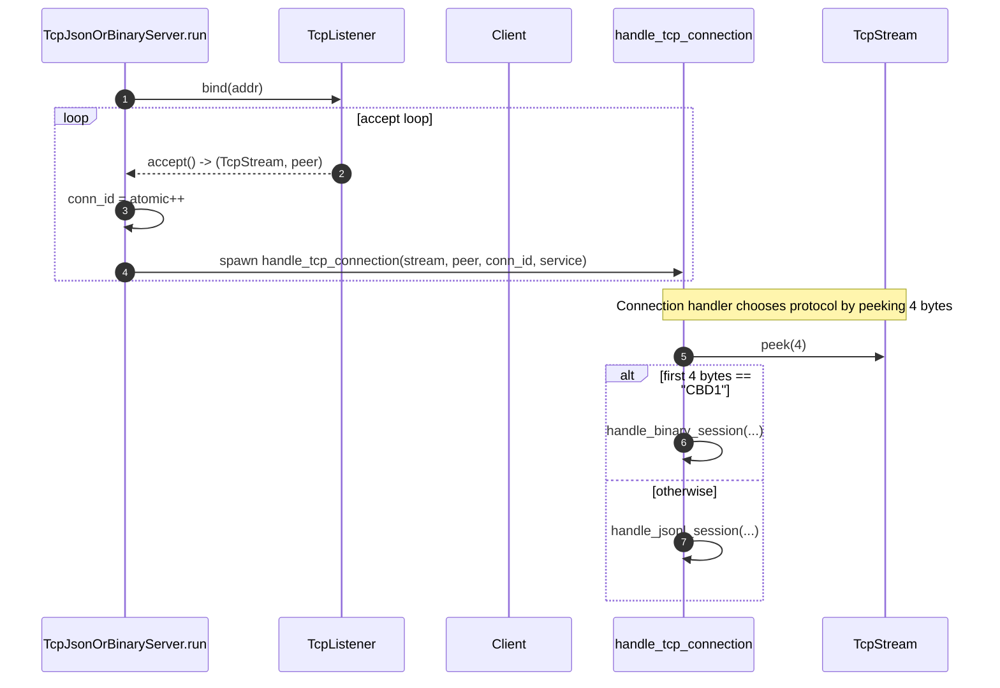
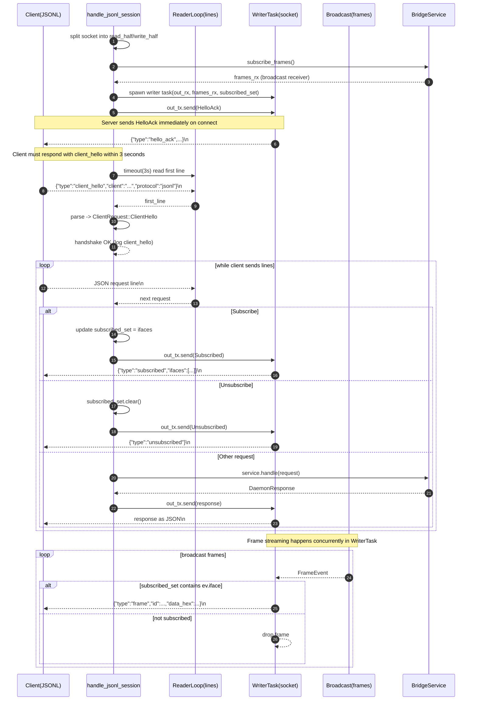
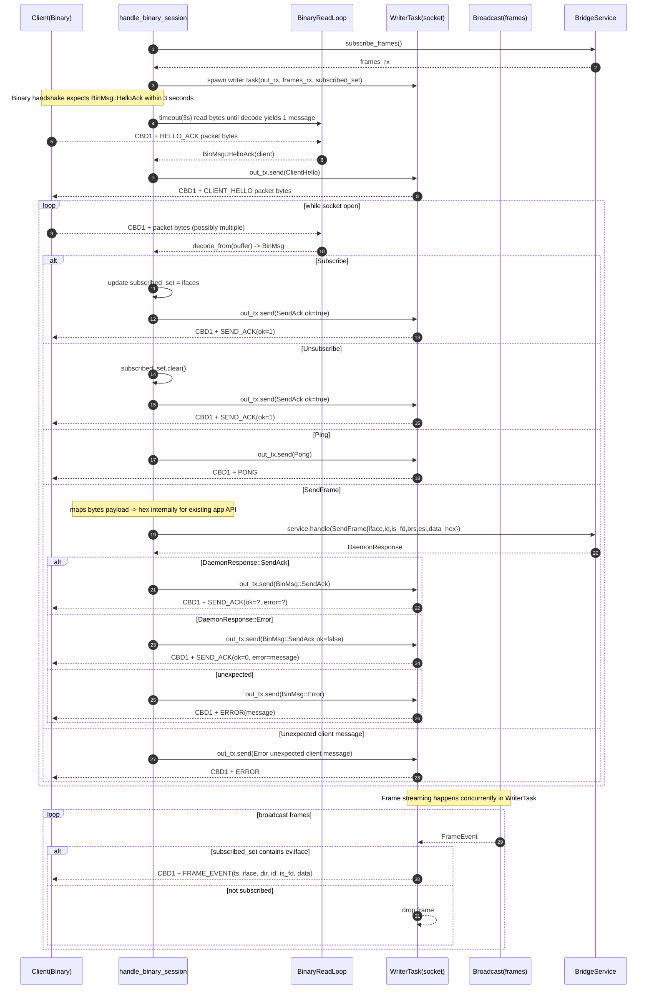
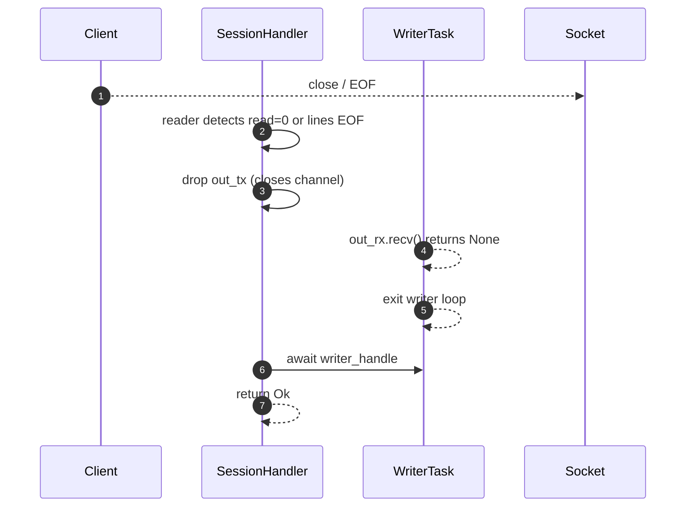

Got it — those errors are because I used `flowchart` syntax (and also included characters like `():` in node labels that some Mermaid renderers choke on). You asked specifically for **`sequenceDiagram`**, so here are **detailed sequence diagrams** for the full `transport_tcp.rs` behavior.

---

## 1) Server accept loop + mode autodetect (JSONL vs Binary)



---

## 2) JSONL session: handshake, writer task, reader loop, and frame streaming



---

## 3) Binary session: handshake, decode loop, writer task, and frame streaming



---

## 4) Shutdown behavior (both modes)



---
 **one combined sequence diagram** that shows JSONL and Binary as two lifelines under a single “alt” block


```mermaid
sequenceDiagram
  autonumber
  participant C as Client
  participant Main as TcpServer(run)
  participant L as TcpListener
  participant H as ConnHandler(handle_tcp_connection)
  participant S as TcpStream
  participant SV as BridgeService
  participant B as Broadcast(frames)
  participant W as WriterTask

  Main->>L: bind(addr)
  loop accept loop
    L-->>Main: accept() -> (stream, peer)
    Main->>Main: conn_id = atomic++
    Main->>H: spawn(stream, peer, conn_id, service)
  end

  Note over H,S: Autodetect protocol (same port)
  H->>S: peek(4)
  alt First 4 bytes == "CBD1" (Binary mode)
    Note over H,C: Binary handshake
    H->>SV: subscribe_frames()
    SV-->>H: frames_rx
    H->>W: spawn writer(out_rx, frames_rx, subscribed_set, binary_encode)
    H->>S: read bytes until decode yields 1 message (timeout 3s)
    C-->>S: CBD1 + HELLO_ACK packet
    H-->>H: decode -> BinMsg::HelloAck(client)
    H->>W: send BinMsg::ClientHello
    W-->>C: CBD1 + CLIENT_HELLO packet

    par Streaming frames (binary)
      loop broadcast frames
        B-->>W: FrameEvent
        alt iface subscribed
          W-->>C: CBD1 + FRAME_EVENT(ts,iface,dir,id,is_fd,data)
        else not subscribed
          W-->>W: drop
        end
      end
    and Client requests (binary)
      loop while socket open
        C-->>S: CBD1 + packet bytes
        H-->>H: decode_from(buffer) -> BinMsg
        alt Subscribe/Unsubscribe/Ping
          H->>H: update subscribed_set or build Pong
          H->>W: send BinMsg::SendAck(ok=1) or BinMsg::Pong
          W-->>C: CBD1 + ACK/PONG packet
        else SendFrame
          Note over H: bytes->hex mapping for existing app request
          H->>SV: handle(SendFrame{iface,id,is_fd,brs,esi,data_hex})
          SV-->>H: DaemonResponse
          H->>W: send BinMsg::SendAck(ok,error) or BinMsg::Error
          W-->>C: CBD1 + SEND_ACK/ERROR packet
        else Unexpected
          H->>W: send BinMsg::Error("unexpected client message")
          W-->>C: CBD1 + ERROR packet
        end
      end
    end

  else Otherwise (JSONL mode)
    Note over H,C: JSONL handshake
    H->>SV: subscribe_frames()
    SV-->>H: frames_rx
    H->>W: spawn writer(out_rx, frames_rx, subscribed_set, json_serialize)
    H->>W: send DaemonResponse::HelloAck
    W-->>C: {"type":"hello_ack",...}\n

    H->>S: read first JSON line (timeout 3s)
    C-->>S: {"type":"client_hello","client":"...","protocol":"jsonl"}\n
    H-->>H: parse -> ClientRequest::ClientHello

    par Streaming frames (jsonl)
      loop broadcast frames
        B-->>W: FrameEvent
        alt iface subscribed
          W-->>C: {"type":"frame","id":...,"data_hex":...}\n
        else not subscribed
          W-->>W: drop
        end
      end
    and Client requests (jsonl)
      loop while lines available
        C-->>S: {"type":"..."}\n
        H-->>H: parse -> ClientRequest
        alt Subscribe/Unsubscribe
          H->>H: update subscribed_set
          H->>W: send Subscribed/Unsubscribed
          W-->>C: {"type":"subscribed"/"unsubscribed"}\n
        else Other
          H->>SV: handle(request)
          SV-->>H: DaemonResponse
          H->>W: send response
          W-->>C: response JSON\n
        end
      end
    end
  end

  Note over C,H: Shutdown (both modes)
  C-->>S: close / EOF
  H-->>H: reader ends -> drop out_tx
  W-->>W: out_rx closed -> writer exits
  H-->>H: await writer; end handler
```
